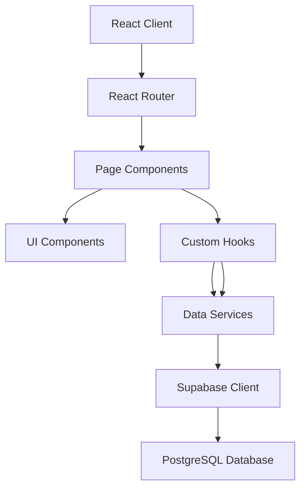
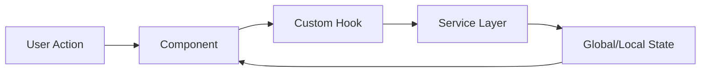
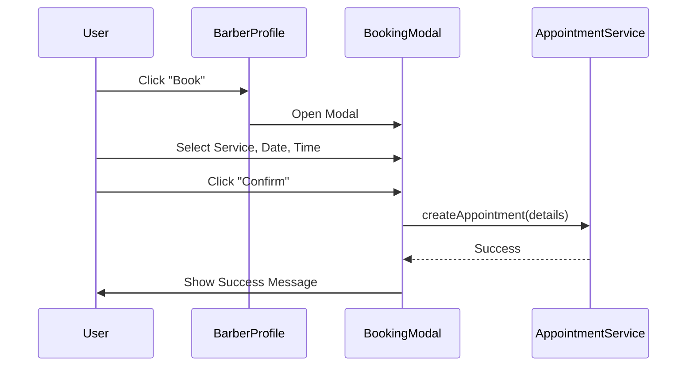

# Design Document

## Overview
DirectCuts is a React-based web application for on-demand personal grooming services. This design outlines a modular, component-based architecture using React, Tailwind CSS, and a mockable data layer to ensure scalability and ease of testing.

## Architecture Design

### System Architecture Diagram


### Data Flow Diagram


## Component Design

### Core Components
- **App**: Root component, handles routing and global providers.
- **Layout**: Manages common UI elements like the Bottom Navigation.
- **SplashScreen**: Initial loading screen.

### Feature Components
- **Home**: `HomeScreen`
  - `SearchBar`: Search input.
  - `CategoryFilter`: Horizontal scroll list of categories.
  - `BarberCard`: Reusable card for barber preview (Trending/Popular).
- **Map**: `NearbyScreen`
  - `MapView`: Placeholder for map integration (Google Maps/Leaflet).
  - `LocationSearch`: Input for location.
- **Appointments**: `AppointmentsScreen`
  - `AppointmentCard`: Displays appointment details and actions.
- **Profile**: `ProfileScreen`
  - `UserProfile`: User details and stats.
  - `MenuOption`: Reusable menu item.
- **Barber Details**: `BarberProfile`
  - `ServiceList`: List of services with booking buttons.
  - `BookingModal`: Modal for selecting service, date, and time.
- **Barber Portal**: `BarberLayout`
  - `BarberDashboard`: Overview stats (Appointments, Revenue, Rating).
  - `AvailabilityManager`: Manage recurring weekly slots.
  - `BarberAppointments`: Manage appointment status (Confirm, Complete, Cancel).

### Shared UI Components (Design System)
- `Button`: Standardized buttons (Primary, Secondary, Ghost).
- `Input`: Text inputs with icons.
- `Modal`: Base modal component.
- `Icon`: Lucide-react icon wrapper.
- `DirectCutsLogo`: SVG Logo component.

## Data Model

### Interfaces

```typescript
interface Barber {
  id: number;
  name: string;
  specialty: string;
  rating: number;
  reviews: number;
  price: number;
  distance: string;
  address: string;
  bio: string;
  image: string;
  featured: boolean;
}

interface Service {
  id: string; // Added ID for better management
  name: string;
  price: number;
  duration: string;
}

interface Appointment {
  id: number;
  barberId: number;
  serviceId: string;
  date: string;
  time: string;
  status: 'upcoming' | 'completed' | 'cancelled';
}

interface User {
  id: string;
  name: string;
  email: string;
  phone: string;
  memberSince: string;
  image: string;
}
```

## Business Process

### Booking Process


## Error Handling Strategy
- **UI Boundaries**: Use Error Boundaries to catch component tree crashes.
- **Service Errors**: Services return standardized error objects.
- **Form Validation**: Client-side validation for booking inputs.
- **Fallbacks**: Loading states and empty states for lists.

## Testing Strategy
- **Unit Tests**: Test individual components (Button, Card) and utilities.
- **Integration Tests**: Test flows like Booking and Search.
- **Mocking**: Use mock data services to simulate backend responses.
