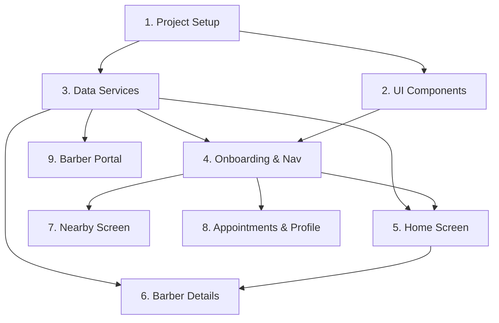

# Implementation Plan

- [x] 1. Project Setup and Core Structure
    - Define TypeScript interfaces (`Barber`, `Service`, `Appointment`, `User`)
    - Create `mockData.ts` with sample data from prototype
    - Create `BarberService` (get all, get by id, search)
    - Create `AppointmentService` (get user appointments, create, cancel)
    - _Design: Data Model_

- [x] 4. Implement Feature: Onboarding & Navigation
    - Create `SplashScreen` component
    - Implement `Layout` component wrapping `BottomNav`
    - Set up `React Router` with routes for Home, Nearby, Appointments, Profile
    - _Requirements: 1.1, 1.2, 1.3, 1.4_

- [x] 5. Implement Feature: Home & Discovery
    - Create `BarberCard` component
    - Create `CategoryFilter` component
    - Implement `HomeScreen` with search logic and lists
    - Connect `HomeScreen` to `BarberService`
    - _Requirements: 2.1, 2.2, 2.3, 2.4_

- [x] 6. Implement Feature: Barber Details & Booking
    - Create `ServiceList` component
    - Create `BookingModal` component with form state
    - Create `SuccessModal` component
    - Implement `BarberProfile` screen
    - Implement booking logic using `AppointmentService`
    - _Requirements: 4.1, 4.2, 4.3, 5.1, 5.2, 5.3_

- [x] 7. Implement Feature: Nearby (Map)
    - Create `NearbyScreen`
    - Implement mock Map View (visual placeholder with pins)
    - Implement location search input
    - _Requirements: 3.1, 3.2, 3.3_

- [x] 8. Implement Feature: Appointments & Profile
    - Create `AppointmentCard` component
    - Implement `AppointmentsScreen` (Upcoming/Past tabs)
    - Implement `ProfileScreen` with user stats
    - _Requirements: 6.1, 6.2, 7.1_

- [x] 9. Implement Feature: Barber Portal (Phase 4)
    - Create `BarberLayout`
    - Implement `BarberDashboard` with stats
    - Implement `AvailabilityManager`
    - Implement `BarberAppointments` with status management
    - Create `barberPortalService`

## Tasks Dependency Diagram

