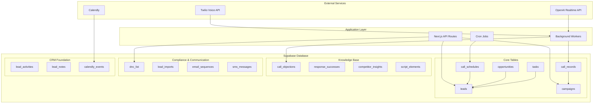
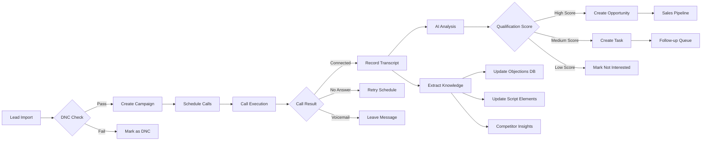
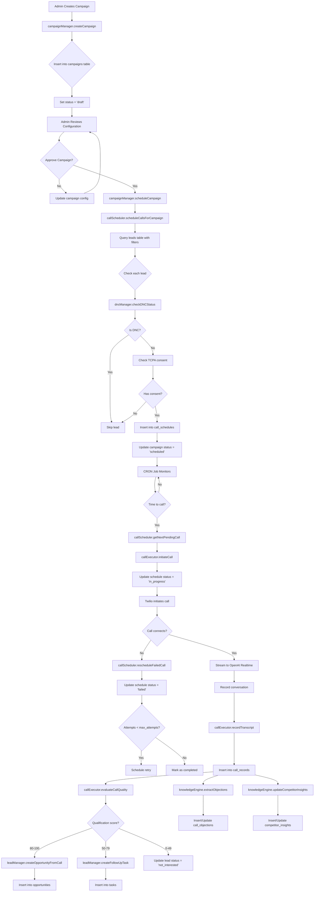
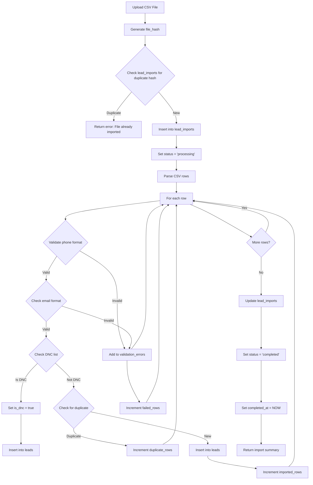
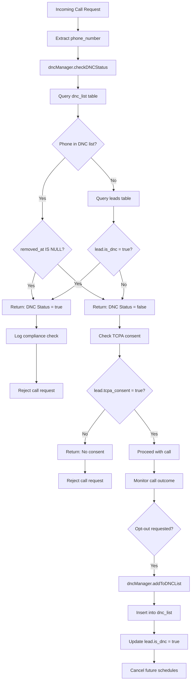
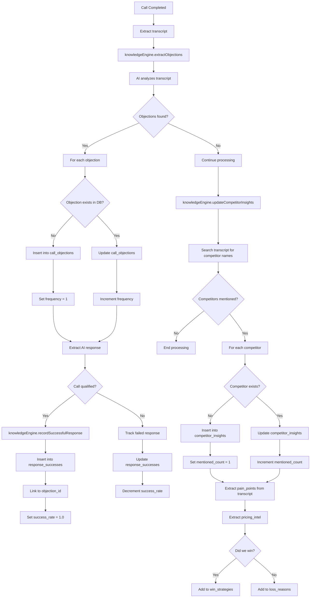

# Design Document: Supabase Database Schema Deployment

## Overview

This design document specifies the complete deployment strategy for the automated calling system database schema to Supabase production. The schema includes 9 core tables for campaign management, call scheduling, knowledge base, and analytics, plus additional tables for DNC compliance, lead management enhancements, and email/SMS workflows.

**Goal**: Deploy a production-ready database schema that supports automated cold calling, lead management, and CRM operations while maintaining data integrity, security, and performance.

**Scope**:
- Deploy automated calling system schema (9 tables)
- Enhance existing leads table for calling integration
- Add compliance and communication tables (4 new tables)
- Implement security policies and audit logging
- Create validation and rollback procedures

## Architecture Design

### System Architecture Diagram



### Data Flow Diagram



## Component Design

### Component 1: Campaign Management System

**Responsibilities**:
- Create and configure calling campaigns
- Define target lead criteria
- Set calling hours and concurrency limits
- Track campaign metrics and ROI

**Interfaces**:
```typescript
interface CampaignManager {
  createCampaign(campaign: Campaign): Promise<Campaign>
  scheduleCampaign(campaignId: string, startDate: Date): Promise<void>
  pauseCampaign(campaignId: string): Promise<void>
  getCampaignMetrics(campaignId: string): Promise<CampaignMetrics>
}
```

**Dependencies**:
- campaigns table
- call_schedules table
- leads table (with phone numbers)
- dnc_list table (for filtering)

### Component 2: Call Scheduler

**Responsibilities**:
- Schedule calls based on campaign rules
- Respect calling hours and timezones
- Manage retry attempts
- Handle concurrent call limits

**Interfaces**:
```typescript
interface CallScheduler {
  scheduleCallsForCampaign(campaignId: string): Promise<CallSchedule[]>
  getNextPendingCall(): Promise<CallSchedule | null>
  rescheduleFailedCall(scheduleId: string, nextAttempt: Date): Promise<void>
  cancelScheduledCall(scheduleId: string): Promise<void>
}
```

**Dependencies**:
- call_schedules table
- campaigns table
- leads table
- dnc_list table

### Component 3: Call Executor

**Responsibilities**:
- Execute outbound calls via Twilio
- Stream audio to/from OpenAI Realtime API
- Record call transcripts and metadata
- Evaluate call quality and outcomes

**Interfaces**:
```typescript
interface CallExecutor {
  initiateCall(schedule: CallSchedule): Promise<CallRecord>
  handleCallCompleted(callSid: string, outcome: CallOutcome): Promise<void>
  recordTranscript(callSid: string, transcript: string): Promise<void>
  evaluateCallQuality(callRecord: CallRecord): Promise<QualificationScore>
}
```

**Dependencies**:
- call_records table
- call_schedules table
- opportunities table
- tasks table
- Twilio Voice API
- OpenAI Realtime API

### Component 4: Knowledge Base Engine

**Responsibilities**:
- Extract objections from call transcripts
- Track successful response patterns
- Identify competitor mentions
- Optimize script elements based on success rates

**Interfaces**:
```typescript
interface KnowledgeBaseEngine {
  extractObjections(transcript: string, callRecord: CallRecord): Promise<void>
  recordSuccessfulResponse(objectionId: string, response: string, callId: string): Promise<void>
  updateCompetitorInsights(transcript: string, campaignType: CampaignType): Promise<void>
  analyzeScriptPerformance(scriptElement: ScriptElement): Promise<PerformanceMetrics>
}
```

**Dependencies**:
- call_objections table
- response_successes table
- competitor_insights table
- script_elements table
- call_records table

### Component 5: Lead Management Integration

**Responsibilities**:
- Sync leads with calling campaigns
- Update lead status based on call outcomes
- Create opportunities from qualified calls
- Generate follow-up tasks

**Interfaces**:
```typescript
interface LeadManager {
  addLeadToCampaign(leadId: string, campaignId: string): Promise<void>
  updateLeadFromCallOutcome(leadId: string, callRecord: CallRecord): Promise<void>
  createOpportunityFromCall(leadId: string, callRecord: CallRecord): Promise<Opportunity>
  createFollowUpTask(leadId: string, taskType: TaskType, dueDate: Date): Promise<Task>
}
```

**Dependencies**:
- leads table (enhanced with calling fields)
- opportunities table
- tasks table
- call_records table
- lead_activities table

### Component 6: DNC Compliance Manager

**Responsibilities**:
- Maintain Do Not Call list
- Check leads against DNC before calling
- Honor opt-out requests
- Generate compliance reports

**Interfaces**:
```typescript
interface DNCComplianceManager {
  addToDNCList(phoneNumber: string, reason: string): Promise<void>
  checkDNCStatus(phoneNumber: string): Promise<boolean>
  removeFromDNC(phoneNumber: string, reason: string): Promise<void>
  getDNCReport(startDate: Date, endDate: Date): Promise<DNCReport>
}
```

**Dependencies**:
- dnc_list table
- leads table
- call_schedules table

## Data Model

### Core Data Structure Definitions

```typescript
// Campaign Table
interface Campaign {
  id: string; // TEXT PRIMARY KEY (e.g., 'cmp_20250113_001')
  name: string;
  type: 'internet' | 'voip' | 'security' | 'cisco';
  status: 'draft' | 'scheduled' | 'active' | 'paused' | 'completed';
  start_date: Date;
  end_date?: Date | null;
  calling_hours: {
    start: string; // "09:00"
    end: string; // "17:00"
    timezone: string; // "America/Los_Angeles"
    days_of_week: number[]; // [1,2,3,4,5] Mon-Fri
  };
  target_leads: Record<string, unknown>; // JSON criteria
  call_config: {
    max_attempts: number; // 3
    retry_delay_hours: number; // 24
    concurrent_calls: number; // 3
    answering_machine_action: 'leave_message' | 'hangup' | 'retry_later';
    call_recording_enabled: boolean;
  };
  metrics: Record<string, unknown>; // Aggregate stats
  created_by: string;
  created_at: Date;
  updated_at: Date;
}

// Call Schedule Table
interface CallSchedule {
  id: string; // TEXT PRIMARY KEY
  campaign_id: string; // FK to campaigns
  lead_id: string; // FK to leads (UUID as TEXT)
  scheduled_for: Date;
  timezone: string;
  attempt_number: number; // 1, 2, 3...
  status: 'pending' | 'in_progress' | 'completed' | 'failed' | 'cancelled';
  call_sid?: string | null; // Twilio Call SID
  connected?: boolean;
  duration_seconds?: number | null;
  outcome?: 'qualified' | 'not_interested' | 'callback' | 'voicemail' | 'no_answer' | 'busy' | null;
  qualification_score?: number | null; // 0-100
  next_action?: 'follow_up' | 'send_info' | 'schedule_callback' | 'no_action' | null;
  cost_per_call: number; // DECIMAL(10,4) default 0.025
  created_at: Date;
  updated_at: Date;
}

// Call Record Table
interface CallRecord {
  id: string; // TEXT PRIMARY KEY
  campaign_id: string; // FK to campaigns
  lead_phone: string; // E.164 format
  lead_name: string;
  company_name: string;
  status: 'completed' | 'failed' | 'no_answer' | 'busy' | 'voicemail';
  duration_seconds: number;
  transcript?: string | null;
  ai_summary: {
    key_points?: string[];
    objections?: string[];
    interest_level?: string;
    next_steps?: string;
  };
  qualification_score: number; // 0-100
  outcome: 'qualified' | 'not_interested' | 'callback' | 'voicemail' | 'no_answer';
  cost: number; // DECIMAL(10,4)
  created_at: Date;
}

// Enhanced Leads Table (additions to existing schema)
interface Lead {
  // ... existing fields ...

  // NEW: Calling-specific fields
  phone: string; // E.164 format: +12135551234
  phone_type?: 'mobile' | 'landline' | 'voip' | 'unknown' | null;
  phone_valid?: boolean | null; // Phone validation result
  phone_carrier?: string | null; // Carrier name

  // NEW: TCPA Compliance
  tcpa_consent: boolean; // Default false
  tcpa_consent_date?: Date | null;
  tcpa_consent_method?: 'web_form' | 'phone' | 'email' | 'sms' | null;
  tcpa_consent_ip?: string | null;

  // NEW: Calling Status
  last_call_date?: Date | null;
  last_call_outcome?: 'qualified' | 'not_interested' | 'callback' | 'voicemail' | 'no_answer' | 'busy' | null;
  total_call_attempts?: number; // Default 0

  // NEW: DNC Status
  is_dnc: boolean; // Default false
  dnc_date?: Date | null;
  dnc_reason?: string | null;

  // NEW: Best Contact Times
  best_contact_hours?: {
    timezone: string;
    preferred_days: number[]; // 0-6
    preferred_hours: string[]; // ["09:00-12:00", "14:00-17:00"]
  } | null;
}

// DNC List Table (NEW)
interface DNCList {
  id: string; // UUID PRIMARY KEY
  phone_number: string; // E.164 format, UNIQUE
  reason: 'explicit_request' | 'legal_requirement' | 'internal_policy' | 'complaint';
  notes?: string | null;
  added_by: string; // User ID or system
  added_at: Date;
  removed_at?: Date | null; // Soft delete / reactivation
  removed_by?: string | null;
}

// Lead Import Table (NEW)
interface LeadImport {
  id: string; // UUID PRIMARY KEY
  file_name: string;
  file_size: number; // bytes
  file_hash: string; // SHA-256 for deduplication
  total_rows: number;
  imported_rows: number;
  failed_rows: number;
  duplicate_rows: number;
  validation_errors: Array<{
    row: number;
    field: string;
    error: string;
  }>;
  status: 'pending' | 'processing' | 'completed' | 'failed';
  campaign_id?: string | null; // FK to campaigns
  imported_by: string; // User ID
  started_at?: Date | null;
  completed_at?: Date | null;
  created_at: Date;
}

// Email Sequence Table (NEW)
interface EmailSequence {
  id: string; // UUID PRIMARY KEY
  name: string;
  description?: string | null;
  trigger_type: 'manual' | 'call_outcome' | 'time_based' | 'lead_action';
  trigger_conditions: Record<string, unknown>; // JSON config
  emails: Array<{
    sequence_order: number;
    delay_hours: number; // Hours after trigger or previous email
    subject: string;
    body_html: string;
    body_text: string;
  }>;
  status: 'draft' | 'active' | 'paused' | 'archived';
  campaign_type?: 'internet' | 'voip' | 'security' | 'cisco' | null;
  created_by: string;
  created_at: Date;
  updated_at: Date;
}

// SMS Message Table (NEW)
interface SMSMessage {
  id: string; // UUID PRIMARY KEY
  lead_id: string; // FK to leads (UUID)
  phone_number: string; // E.164 format
  message: string; // Max 160 chars per segment
  message_type: 'follow_up' | 'appointment_reminder' | 'info_request' | 'thank_you';
  status: 'queued' | 'sent' | 'delivered' | 'failed' | 'undelivered';
  error_message?: string | null;
  twilio_sid?: string | null; // Twilio Message SID
  segments: number; // SMS segment count
  cost: number; // DECIMAL(10,4)
  sent_at?: Date | null;
  delivered_at?: Date | null;
  created_at: Date;
  created_by: string;
}

// Opportunity Table (Enhanced)
interface Opportunity {
  id: string; // TEXT PRIMARY KEY
  lead_phone: string; // Link to lead by phone
  lead_id?: string | null; // NEW: Direct UUID FK to leads
  company_name: string;
  contact_name: string;
  estimated_value: number; // DECIMAL(10,2)
  stage: 'qualify' | 'propose' | 'negotiate' | 'close' | 'won' | 'lost';
  probability: number; // 0-100
  source: string; // Default 'cold_call'
  campaign_id?: string | null; // FK to campaigns
  close_date?: Date | null;

  // NEW: Additional tracking
  won_date?: Date | null;
  lost_date?: Date | null;
  lost_reason?: string | null;
  assigned_to?: string | null; // User ID

  created_at: Date;
  updated_at: Date;
}

// Task Table (Enhanced)
interface Task {
  id: string; // TEXT PRIMARY KEY
  title: string;
  description?: string | null;
  type: 'follow_up' | 'send_info' | 'schedule_callback' | 'no_action';
  status: 'pending' | 'in_progress' | 'completed' | 'cancelled';
  priority: 'low' | 'medium' | 'high' | 'critical';
  due_date: Date;
  assigned_to: string; // User ID
  related_to?: string | null; // Lead ID, Opportunity ID, etc.

  // NEW: Enhanced tracking
  lead_id?: string | null; // Direct FK to leads
  opportunity_id?: string | null; // FK to opportunities
  campaign_id?: string | null; // FK to campaigns

  created_from_call?: string | null; // Call Record ID
  completed_at?: Date | null;
  created_at: Date;
  updated_at: Date;
}
```

### Data Model Diagram

```mermaid
erDiagram
    campaigns ||--o{ call_schedules : "has"
    campaigns ||--o{ call_records : "generates"
    campaigns ||--o{ opportunities : "creates"
    campaigns ||--o{ tasks : "spawns"

    leads ||--o{ call_schedules : "scheduled for"
    leads ||--o{ opportunities : "becomes"
    leads ||--o{ tasks : "requires"
    leads ||--o{ lead_activities : "tracks"
    leads ||--o{ lead_imports : "imported in"
    leads ||--o{ sms_messages : "receives"

    call_schedules ||--o| call_records : "results in"
    call_records ||--o{ call_objections : "identifies"
    call_records ||--o{ response_successes : "learns from"
    call_records ||--o{ competitor_insights : "discovers"
    call_records ||--o{ script_elements : "optimizes"

    call_objections ||--o{ response_successes : "has"

    dnc_list ||--o{ leads : "excludes"

    email_sequences ||--o{ lead_activities : "sends"

    campaigns {
        TEXT id PK
        TEXT name
        TEXT type
        TEXT status
        TIMESTAMPTZ start_date
        TIMESTAMPTZ end_date
        JSONB calling_hours
        JSONB target_leads
        JSONB call_config
        JSONB metrics
        TEXT created_by
        TIMESTAMPTZ created_at
        TIMESTAMPTZ updated_at
    }

    call_schedules {
        TEXT id PK
        TEXT campaign_id FK
        TEXT lead_id FK
        TIMESTAMPTZ scheduled_for
        TEXT timezone
        INTEGER attempt_number
        TEXT status
        TEXT call_sid
        BOOLEAN connected
        INTEGER duration_seconds
        TEXT outcome
        INTEGER qualification_score
        TEXT next_action
        DECIMAL cost_per_call
        TIMESTAMPTZ created_at
        TIMESTAMPTZ updated_at
    }

    call_records {
        TEXT id PK
        TEXT campaign_id FK
        TEXT lead_phone
        TEXT lead_name
        TEXT company_name
        TEXT status
        INTEGER duration_seconds
        TEXT transcript
        JSONB ai_summary
        INTEGER qualification_score
        TEXT outcome
        DECIMAL cost
        TIMESTAMPTZ created_at
    }

    leads {
        UUID id PK
        TEXT phone
        TEXT phone_type
        BOOLEAN phone_valid
        TEXT phone_carrier
        BOOLEAN tcpa_consent
        TIMESTAMPTZ tcpa_consent_date
        TEXT tcpa_consent_method
        TEXT tcpa_consent_ip
        TIMESTAMPTZ last_call_date
        TEXT last_call_outcome
        INTEGER total_call_attempts
        BOOLEAN is_dnc
        TIMESTAMPTZ dnc_date
        TEXT dnc_reason
        JSONB best_contact_hours
    }

    dnc_list {
        UUID id PK
        TEXT phone_number UNIQUE
        TEXT reason
        TEXT notes
        TEXT added_by
        TIMESTAMPTZ added_at
        TIMESTAMPTZ removed_at
        TEXT removed_by
    }

    lead_imports {
        UUID id PK
        TEXT file_name
        INTEGER file_size
        TEXT file_hash
        INTEGER total_rows
        INTEGER imported_rows
        INTEGER failed_rows
        INTEGER duplicate_rows
        JSONB validation_errors
        TEXT status
        TEXT campaign_id FK
        TEXT imported_by
        TIMESTAMPTZ started_at
        TIMESTAMPTZ completed_at
        TIMESTAMPTZ created_at
    }

    email_sequences {
        UUID id PK
        TEXT name
        TEXT description
        TEXT trigger_type
        JSONB trigger_conditions
        JSONB emails
        TEXT status
        TEXT campaign_type
        TEXT created_by
        TIMESTAMPTZ created_at
        TIMESTAMPTZ updated_at
    }

    sms_messages {
        UUID id PK
        UUID lead_id FK
        TEXT phone_number
        TEXT message
        TEXT message_type
        TEXT status
        TEXT error_message
        TEXT twilio_sid
        INTEGER segments
        DECIMAL cost
        TIMESTAMPTZ sent_at
        TIMESTAMPTZ delivered_at
        TIMESTAMPTZ created_at
        TEXT created_by
    }
```

## Business Process

### Process 1: Campaign Creation and Execution



### Process 2: Lead Import with Validation



### Process 3: DNC Compliance Check



### Process 4: Knowledge Base Learning



## Error Handling Strategy

### Database Errors

**Conflict Errors** (e.g., duplicate primary keys):
- Use `ON CONFLICT DO NOTHING` for idempotent inserts
- Use `ON CONFLICT DO UPDATE` for upserts with unique constraints
- Example: `INSERT INTO campaigns VALUES (...) ON CONFLICT (id) DO NOTHING;`

**Foreign Key Violations**:
- Validate foreign key existence before insert
- Use `ON DELETE CASCADE` for dependent data (call_schedules -> campaigns)
- Use `ON DELETE SET NULL` for optional relationships (opportunities -> campaigns)

**Data Type Errors**:
- Validate all inputs at application layer before database insertion
- Use TypeScript interfaces for type safety
- Phone numbers: Always validate E.164 format (`^\\+[1-9]\\d{1,14}$`)
- Timestamps: Always use ISO 8601 format with timezone

### Application Errors

**Call Failure Handling**:
```typescript
try {
  const callRecord = await callExecutor.initiateCall(schedule);
} catch (error) {
  if (error.code === 'TWILIO_BUSY') {
    await callScheduler.rescheduleFailedCall(schedule.id, Date.now() + 3600000); // 1 hour
  } else if (error.code === 'INVALID_PHONE') {
    await markLeadAsInvalid(schedule.lead_id);
  } else {
    await logCriticalError(error);
    throw error;
  }
}
```

**Transaction Rollback**:
All multi-table operations should use transactions:
```sql
BEGIN;
  INSERT INTO opportunities (...);
  INSERT INTO tasks (...);
  UPDATE leads SET status = 'opportunity' WHERE id = :lead_id;
COMMIT;
```

If any step fails, rollback entire transaction to maintain consistency.

### Rollback Strategy

**Schema Rollback**:
```sql
-- Drop tables in reverse dependency order
DROP TABLE IF EXISTS sms_messages;
DROP TABLE IF EXISTS email_sequences;
DROP TABLE IF EXISTS lead_imports;
DROP TABLE IF EXISTS dnc_list;
DROP TABLE IF EXISTS tasks;
DROP TABLE IF EXISTS opportunities;
DROP TABLE IF EXISTS script_elements;
DROP TABLE IF EXISTS competitor_insights;
DROP TABLE IF EXISTS response_successes;
DROP TABLE IF EXISTS call_objections;
DROP TABLE IF EXISTS call_records;
DROP TABLE IF EXISTS call_schedules;
DROP TABLE IF EXISTS campaigns;

-- Restore from backup if exists
-- (restore commands depend on Supabase backup format)
```

## Schema Deployment Specification

### Pre-Deployment Steps

**Step 1: Backup Existing Database**
```bash
# Using Supabase CLI
supabase db dump -f backup-$(date +%Y%m%d-%H%M%S).sql

# Or via Supabase Dashboard:
# Settings > Database > Backups > Create Backup
```

**Step 2: Validate Current Schema**
```sql
-- Check existing tables
SELECT table_name, table_type
FROM information_schema.tables
WHERE table_schema = 'public'
ORDER BY table_name;

-- Check existing leads table structure
SELECT column_name, data_type, is_nullable, column_default
FROM information_schema.columns
WHERE table_schema = 'public' AND table_name = 'leads'
ORDER BY ordinal_position;

-- Check for conflicts with new table names
SELECT table_name
FROM information_schema.tables
WHERE table_schema = 'public'
  AND table_name IN ('campaigns', 'call_schedules', 'call_records', 'call_objections',
                     'response_successes', 'competitor_insights', 'script_elements',
                     'tasks', 'opportunities', 'dnc_list', 'lead_imports',
                     'email_sequences', 'sms_messages');
```

**Step 3: Environment Check**
```sql
-- Verify extensions
SELECT * FROM pg_extension WHERE extname IN ('uuid-ossp', 'pg_stat_statements');

-- Check available storage
SELECT pg_size_pretty(pg_database_size(current_database())) as database_size;

-- Verify RLS is available
SELECT * FROM pg_roles WHERE rolname = 'service_role';
```

### Deployment Execution

**Phase 1: Deploy Core Calling Tables** (Execute `database/automated-calling-system-schema.sql`)

```sql
-- Execute the entire schema file
-- This includes:
-- 1. campaigns table
-- 2. call_schedules table
-- 3. call_records table
-- 4. call_objections table
-- 5. response_successes table
-- 6. competitor_insights table
-- 7. script_elements table
-- 8. tasks table
-- 9. opportunities table
-- 10. RLS policies
-- 11. Triggers and functions
-- 12. Grants
-- 13. Sample seed data
```

**Phase 2: Enhance Leads Table**

```sql
-- Add calling-specific columns to existing leads table
ALTER TABLE public.leads ADD COLUMN IF NOT EXISTS phone TEXT;
ALTER TABLE public.leads ADD COLUMN IF NOT EXISTS phone_type TEXT CHECK (phone_type IN ('mobile', 'landline', 'voip', 'unknown'));
ALTER TABLE public.leads ADD COLUMN IF NOT EXISTS phone_valid BOOLEAN;
ALTER TABLE public.leads ADD COLUMN IF NOT EXISTS phone_carrier TEXT;

-- TCPA Compliance columns
ALTER TABLE public.leads ADD COLUMN IF NOT EXISTS tcpa_consent BOOLEAN DEFAULT FALSE;
ALTER TABLE public.leads ADD COLUMN IF NOT EXISTS tcpa_consent_date TIMESTAMPTZ;
ALTER TABLE public.leads ADD COLUMN IF NOT EXISTS tcpa_consent_method TEXT CHECK (tcpa_consent_method IN ('web_form', 'phone', 'email', 'sms'));
ALTER TABLE public.leads ADD COLUMN IF NOT EXISTS tcpa_consent_ip TEXT;

-- Calling status columns
ALTER TABLE public.leads ADD COLUMN IF NOT EXISTS last_call_date TIMESTAMPTZ;
ALTER TABLE public.leads ADD COLUMN IF NOT EXISTS last_call_outcome TEXT CHECK (last_call_outcome IN ('qualified', 'not_interested', 'callback', 'voicemail', 'no_answer', 'busy'));
ALTER TABLE public.leads ADD COLUMN IF NOT EXISTS total_call_attempts INTEGER DEFAULT 0;

-- DNC columns
ALTER TABLE public.leads ADD COLUMN IF NOT EXISTS is_dnc BOOLEAN DEFAULT FALSE;
ALTER TABLE public.leads ADD COLUMN IF NOT EXISTS dnc_date TIMESTAMPTZ;
ALTER TABLE public.leads ADD COLUMN IF NOT EXISTS dnc_reason TEXT;

-- Best contact time preference
ALTER TABLE public.leads ADD COLUMN IF NOT EXISTS best_contact_hours JSONB;

-- Add indexes for calling operations
CREATE INDEX IF NOT EXISTS idx_leads_phone ON public.leads(phone) WHERE phone IS NOT NULL;
CREATE INDEX IF NOT EXISTS idx_leads_tcpa_consent ON public.leads(tcpa_consent) WHERE tcpa_consent = TRUE;
CREATE INDEX IF NOT EXISTS idx_leads_is_dnc ON public.leads(is_dnc) WHERE is_dnc = TRUE;
CREATE INDEX IF NOT EXISTS idx_leads_last_call_date ON public.leads(last_call_date DESC);

-- Add phone validation constraint
ALTER TABLE public.leads ADD CONSTRAINT phone_e164_format
  CHECK (phone IS NULL OR phone ~ '^\+[1-9]\d{1,14}$');

-- Comment on new columns
COMMENT ON COLUMN public.leads.phone IS 'Phone number in E.164 format (+12135551234)';
COMMENT ON COLUMN public.leads.tcpa_consent IS 'Whether lead has provided TCPA consent for automated calls';
COMMENT ON COLUMN public.leads.is_dnc IS 'Whether lead is on Do Not Call list';
```

**Phase 3: Deploy Compliance Tables**

```sql
-- DNC List Table
CREATE TABLE IF NOT EXISTS public.dnc_list (
  id UUID PRIMARY KEY DEFAULT gen_random_uuid(),
  phone_number TEXT UNIQUE NOT NULL,
  reason TEXT NOT NULL CHECK (reason IN ('explicit_request', 'legal_requirement', 'internal_policy', 'complaint')),
  notes TEXT,
  added_by TEXT NOT NULL,
  added_at TIMESTAMPTZ NOT NULL DEFAULT NOW(),
  removed_at TIMESTAMPTZ,
  removed_by TEXT,

  -- Constraint: phone must be E.164 format
  CONSTRAINT dnc_phone_e164_format CHECK (phone_number ~ '^\+[1-9]\d{1,14}$')
);

CREATE INDEX IF NOT EXISTS idx_dnc_list_phone ON public.dnc_list(phone_number);
CREATE INDEX IF NOT EXISTS idx_dnc_list_added_at ON public.dnc_list(added_at DESC);
CREATE INDEX IF NOT EXISTS idx_dnc_list_active ON public.dnc_list(phone_number) WHERE removed_at IS NULL;

ALTER TABLE public.dnc_list ENABLE ROW LEVEL SECURITY;
CREATE POLICY "Service role full access dnc_list" ON public.dnc_list FOR ALL USING (true);

GRANT ALL ON public.dnc_list TO service_role;

COMMENT ON TABLE public.dnc_list IS 'Do Not Call list for compliance with TCPA regulations';
COMMENT ON COLUMN public.dnc_list.phone_number IS 'Phone number in E.164 format to exclude from calling';
```

**Phase 4: Deploy Import Tracking Table**

```sql
-- Lead Imports Table
CREATE TABLE IF NOT EXISTS public.lead_imports (
  id UUID PRIMARY KEY DEFAULT gen_random_uuid(),
  file_name TEXT NOT NULL,
  file_size INTEGER NOT NULL,
  file_hash TEXT NOT NULL, -- SHA-256 for deduplication
  total_rows INTEGER NOT NULL DEFAULT 0,
  imported_rows INTEGER NOT NULL DEFAULT 0,
  failed_rows INTEGER NOT NULL DEFAULT 0,
  duplicate_rows INTEGER NOT NULL DEFAULT 0,
  validation_errors JSONB DEFAULT '[]'::jsonb,
  status TEXT NOT NULL DEFAULT 'pending' CHECK (status IN ('pending', 'processing', 'completed', 'failed')),
  campaign_id TEXT REFERENCES public.campaigns(id) ON DELETE SET NULL,
  imported_by TEXT NOT NULL,
  started_at TIMESTAMPTZ,
  completed_at TIMESTAMPTZ,
  created_at TIMESTAMPTZ NOT NULL DEFAULT NOW()
);

CREATE INDEX IF NOT EXISTS idx_lead_imports_status ON public.lead_imports(status);
CREATE INDEX IF NOT EXISTS idx_lead_imports_campaign ON public.lead_imports(campaign_id);
CREATE INDEX IF NOT EXISTS idx_lead_imports_file_hash ON public.lead_imports(file_hash);
CREATE INDEX IF NOT EXISTS idx_lead_imports_created_at ON public.lead_imports(created_at DESC);

ALTER TABLE public.lead_imports ENABLE ROW LEVEL SECURITY;
CREATE POLICY "Service role full access lead_imports" ON public.lead_imports FOR ALL USING (true);

GRANT ALL ON public.lead_imports TO service_role;

COMMENT ON TABLE public.lead_imports IS 'Tracks CSV lead import jobs with validation and error reporting';
```

**Phase 5: Deploy Communication Tables**

```sql
-- Email Sequences Table
CREATE TABLE IF NOT EXISTS public.email_sequences (
  id UUID PRIMARY KEY DEFAULT gen_random_uuid(),
  name TEXT NOT NULL,
  description TEXT,
  trigger_type TEXT NOT NULL CHECK (trigger_type IN ('manual', 'call_outcome', 'time_based', 'lead_action')),
  trigger_conditions JSONB NOT NULL DEFAULT '{}'::jsonb,
  emails JSONB NOT NULL DEFAULT '[]'::jsonb,
  status TEXT NOT NULL DEFAULT 'draft' CHECK (status IN ('draft', 'active', 'paused', 'archived')),
  campaign_type TEXT CHECK (campaign_type IN ('internet', 'voip', 'security', 'cisco')),
  created_by TEXT NOT NULL,
  created_at TIMESTAMPTZ NOT NULL DEFAULT NOW(),
  updated_at TIMESTAMPTZ NOT NULL DEFAULT NOW()
);

CREATE INDEX IF NOT EXISTS idx_email_sequences_status ON public.email_sequences(status);
CREATE INDEX IF NOT EXISTS idx_email_sequences_trigger_type ON public.email_sequences(trigger_type);
CREATE INDEX IF NOT EXISTS idx_email_sequences_campaign_type ON public.email_sequences(campaign_type);

CREATE TRIGGER update_email_sequences_updated_at
  BEFORE UPDATE ON public.email_sequences
  FOR EACH ROW EXECUTE FUNCTION update_updated_at_column();

ALTER TABLE public.email_sequences ENABLE ROW LEVEL SECURITY;
CREATE POLICY "Service role full access email_sequences" ON public.email_sequences FOR ALL USING (true);

GRANT ALL ON public.email_sequences TO service_role;

COMMENT ON TABLE public.email_sequences IS 'Email nurture sequences triggered by call outcomes';

-- SMS Messages Table
CREATE TABLE IF NOT EXISTS public.sms_messages (
  id UUID PRIMARY KEY DEFAULT gen_random_uuid(),
  lead_id UUID REFERENCES public.leads(id) ON DELETE CASCADE,
  phone_number TEXT NOT NULL,
  message TEXT NOT NULL,
  message_type TEXT NOT NULL CHECK (message_type IN ('follow_up', 'appointment_reminder', 'info_request', 'thank_you')),
  status TEXT NOT NULL DEFAULT 'queued' CHECK (status IN ('queued', 'sent', 'delivered', 'failed', 'undelivered')),
  error_message TEXT,
  twilio_sid TEXT,
  segments INTEGER NOT NULL DEFAULT 1,
  cost DECIMAL(10, 4) DEFAULT 0.0075,
  sent_at TIMESTAMPTZ,
  delivered_at TIMESTAMPTZ,
  created_at TIMESTAMPTZ NOT NULL DEFAULT NOW(),
  created_by TEXT NOT NULL,

  CONSTRAINT sms_phone_e164_format CHECK (phone_number ~ '^\+[1-9]\d{1,14}$')
);

CREATE INDEX IF NOT EXISTS idx_sms_messages_lead_id ON public.sms_messages(lead_id);
CREATE INDEX IF NOT EXISTS idx_sms_messages_phone ON public.sms_messages(phone_number);
CREATE INDEX IF NOT EXISTS idx_sms_messages_status ON public.sms_messages(status);
CREATE INDEX IF NOT EXISTS idx_sms_messages_created_at ON public.sms_messages(created_at DESC);

ALTER TABLE public.sms_messages ENABLE ROW LEVEL SECURITY;
CREATE POLICY "Service role full access sms_messages" ON public.sms_messages FOR ALL USING (true);

GRANT ALL ON public.sms_messages TO service_role;

COMMENT ON TABLE public.sms_messages IS 'SMS follow-up messages sent to leads';
```

**Phase 6: Add Foreign Key Relationships**

```sql
-- Add FK from call_schedules to leads (if leads.id is UUID)
-- Note: The schema uses TEXT for lead_id, so we need to ensure compatibility
ALTER TABLE public.call_schedules
  DROP CONSTRAINT IF EXISTS fk_call_schedules_lead_id;

-- If leads.id is UUID, we can add proper FK:
-- ALTER TABLE public.call_schedules
--   ALTER COLUMN lead_id TYPE UUID USING lead_id::uuid,
--   ADD CONSTRAINT fk_call_schedules_lead_id
--   FOREIGN KEY (lead_id) REFERENCES public.leads(id) ON DELETE CASCADE;

-- For now, keep as TEXT and use application-level validation

-- Add FK from opportunities to leads
ALTER TABLE public.opportunities
  ADD COLUMN IF NOT EXISTS lead_id UUID REFERENCES public.leads(id) ON DELETE SET NULL;

CREATE INDEX IF NOT EXISTS idx_opportunities_lead_id ON public.opportunities(lead_id);

-- Add FK from tasks to leads
ALTER TABLE public.tasks
  ADD COLUMN IF NOT EXISTS lead_id UUID REFERENCES public.leads(id) ON DELETE SET NULL;

CREATE INDEX IF NOT EXISTS idx_tasks_lead_id ON public.tasks(lead_id);

-- Add FK enhancements to opportunities
ALTER TABLE public.opportunities
  ADD COLUMN IF NOT EXISTS assigned_to TEXT,
  ADD COLUMN IF NOT EXISTS won_date TIMESTAMPTZ,
  ADD COLUMN IF NOT EXISTS lost_date TIMESTAMPTZ,
  ADD COLUMN IF NOT EXISTS lost_reason TEXT;

-- Add FK enhancements to tasks
ALTER TABLE public.tasks
  ADD COLUMN IF NOT EXISTS opportunity_id TEXT,
  ADD COLUMN IF NOT EXISTS campaign_id TEXT REFERENCES public.campaigns(id) ON DELETE SET NULL;

CREATE INDEX IF NOT EXISTS idx_tasks_opportunity_id ON public.tasks(opportunity_id);
CREATE INDEX IF NOT EXISTS idx_tasks_campaign_id ON public.tasks(campaign_id);
```

### Post-Deployment Verification

**Step 1: Verify All Tables Created**
```sql
-- Check all expected tables exist
SELECT table_name, table_type
FROM information_schema.tables
WHERE table_schema = 'public'
  AND table_name IN (
    'campaigns', 'call_schedules', 'call_records', 'call_objections',
    'response_successes', 'competitor_insights', 'script_elements',
    'tasks', 'opportunities', 'dnc_list', 'lead_imports',
    'email_sequences', 'sms_messages', 'leads'
  )
ORDER BY table_name;

-- Expected result: 14 tables
```

**Step 2: Verify Indexes Created**
```sql
-- Check indexes on critical tables
SELECT
  schemaname,
  tablename,
  indexname,
  indexdef
FROM pg_indexes
WHERE schemaname = 'public'
  AND tablename IN ('campaigns', 'call_schedules', 'call_records', 'leads', 'dnc_list')
ORDER BY tablename, indexname;

-- Verify minimum required indexes exist:
-- - idx_campaigns_status
-- - idx_call_schedules_scheduled_for
-- - idx_call_records_qualification_score
-- - idx_leads_phone
-- - idx_dnc_list_phone
```

**Step 3: Verify RLS Policies**
```sql
-- Check RLS enabled on all tables
SELECT
  schemaname,
  tablename,
  rowsecurity
FROM pg_tables
WHERE schemaname = 'public'
  AND tablename IN (
    'campaigns', 'call_schedules', 'call_records', 'tasks',
    'opportunities', 'dnc_list', 'lead_imports', 'email_sequences', 'sms_messages'
  );

-- All should have rowsecurity = true

-- Check policies exist
SELECT
  schemaname,
  tablename,
  policyname,
  permissive,
  roles,
  cmd
FROM pg_policies
WHERE schemaname = 'public'
ORDER BY tablename, policyname;
```

**Step 4: Verify Triggers**
```sql
-- Check triggers for updated_at
SELECT
  trigger_name,
  event_object_table,
  action_statement
FROM information_schema.triggers
WHERE trigger_schema = 'public'
  AND trigger_name LIKE '%updated_at%';

-- Expected triggers:
-- - update_campaigns_updated_at
-- - update_call_schedules_updated_at
-- - update_tasks_updated_at
-- - update_opportunities_updated_at
-- - update_email_sequences_updated_at
```

**Step 5: Verify Foreign Keys**
```sql
-- Check foreign key constraints
SELECT
  tc.table_name,
  kcu.column_name,
  ccu.table_name AS foreign_table_name,
  ccu.column_name AS foreign_column_name,
  rc.delete_rule
FROM information_schema.table_constraints AS tc
  JOIN information_schema.key_column_usage AS kcu
    ON tc.constraint_name = kcu.constraint_name
    AND tc.table_schema = kcu.table_schema
  JOIN information_schema.constraint_column_usage AS ccu
    ON ccu.constraint_name = tc.constraint_name
    AND ccu.table_schema = tc.table_schema
  JOIN information_schema.referential_constraints AS rc
    ON rc.constraint_name = tc.constraint_name
WHERE tc.constraint_type = 'FOREIGN KEY'
  AND tc.table_schema = 'public'
  AND tc.table_name IN (
    'call_schedules', 'call_records', 'opportunities', 'tasks',
    'lead_imports', 'sms_messages'
  )
ORDER BY tc.table_name, kcu.column_name;
```

**Step 6: Test Sample Data Insertion**
```sql
-- Test insert into campaigns
INSERT INTO public.campaigns (
  id, name, type, status, start_date, created_by
) VALUES (
  'cmp_test_001',
  'Test Campaign',
  'internet',
  'draft',
  NOW(),
  'system'
) ON CONFLICT (id) DO NOTHING
RETURNING id, name, status;

-- Test insert into leads with new columns
INSERT INTO public.leads (
  full_name, email, phone, company_name,
  tcpa_consent, tcpa_consent_date, tcpa_consent_method,
  is_dnc, source
) VALUES (
  'Test Lead',
  'test@example.com',
  '+12135551234',
  'Test Company',
  TRUE,
  NOW(),
  'web_form',
  FALSE,
  'website'
) RETURNING id, full_name, phone, tcpa_consent;

-- Test DNC list insert
INSERT INTO public.dnc_list (
  phone_number, reason, added_by
) VALUES (
  '+19999999999',
  'explicit_request',
  'system'
) RETURNING id, phone_number, reason;

-- Clean up test data
DELETE FROM public.campaigns WHERE id = 'cmp_test_001';
DELETE FROM public.leads WHERE email = 'test@example.com';
DELETE FROM public.dnc_list WHERE phone_number = '+19999999999';
```

**Step 7: Test Query Performance**
```sql
-- Test critical queries with EXPLAIN ANALYZE
EXPLAIN ANALYZE
SELECT * FROM public.call_schedules
WHERE status = 'pending'
  AND scheduled_for <= NOW()
ORDER BY scheduled_for ASC
LIMIT 10;

-- Should use index idx_call_schedules_scheduled_for

EXPLAIN ANALYZE
SELECT * FROM public.leads
WHERE phone = '+12135551234'
  AND is_dnc = FALSE
  AND tcpa_consent = TRUE;

-- Should use indexes idx_leads_phone, idx_leads_is_dnc, idx_leads_tcpa_consent

EXPLAIN ANALYZE
SELECT * FROM public.dnc_list
WHERE phone_number = '+12135551234'
  AND removed_at IS NULL;

-- Should use index idx_dnc_list_active
```

**Step 8: Verify Permissions**
```sql
-- Check service_role has necessary permissions
SELECT
  grantee,
  table_schema,
  table_name,
  privilege_type
FROM information_schema.role_table_grants
WHERE grantee = 'service_role'
  AND table_schema = 'public'
  AND table_name IN (
    'campaigns', 'call_schedules', 'call_records', 'dnc_list',
    'lead_imports', 'email_sequences', 'sms_messages'
  )
ORDER BY table_name, privilege_type;

-- All tables should have: SELECT, INSERT, UPDATE, DELETE
```

## Performance Optimization

### Critical Queries Identification

**Query 1: Get Next Pending Call**
```sql
-- Most frequent query - executed every few seconds by cron job
SELECT * FROM public.call_schedules
WHERE status = 'pending'
  AND scheduled_for <= NOW()
ORDER BY scheduled_for ASC
LIMIT 1
FOR UPDATE SKIP LOCKED;
```

**Optimization**: Compound index on `(status, scheduled_for)` already created.

**Query 2: DNC Check**
```sql
-- Executed for every call attempt
SELECT phone_number FROM public.dnc_list
WHERE phone_number = $1 AND removed_at IS NULL
UNION
SELECT phone FROM public.leads
WHERE phone = $1 AND is_dnc = TRUE
LIMIT 1;
```

**Optimization**: Partial indexes on both tables for active DNC records.

**Query 3: Lead Qualification Lookup**
```sql
-- Executed after each call
SELECT * FROM public.call_records
WHERE campaign_id = $1
  AND qualification_score >= 80
ORDER BY created_at DESC
LIMIT 100;
```

**Optimization**: Composite index on `(campaign_id, qualification_score DESC, created_at DESC)`.

```sql
CREATE INDEX IF NOT EXISTS idx_call_records_campaign_qual_created
  ON public.call_records(campaign_id, qualification_score DESC, created_at DESC);
```

**Query 4: Campaign Metrics Aggregation**
```sql
-- Executed periodically to update campaign dashboard
SELECT
  campaign_id,
  COUNT(*) as total_calls,
  AVG(duration_seconds) as avg_duration,
  COUNT(*) FILTER (WHERE connected = TRUE) as connected_calls,
  AVG(qualification_score) as avg_qualification_score
FROM public.call_schedules
WHERE campaign_id = $1
GROUP BY campaign_id;
```

**Optimization**: Consider materialized view for large campaigns.

```sql
CREATE MATERIALIZED VIEW IF NOT EXISTS campaign_metrics AS
SELECT
  c.id as campaign_id,
  c.name,
  c.status,
  COUNT(cs.id) as total_scheduled_calls,
  COUNT(cs.id) FILTER (WHERE cs.status = 'completed') as completed_calls,
  COUNT(cs.id) FILTER (WHERE cs.connected = TRUE) as connected_calls,
  AVG(cs.duration_seconds) as avg_duration,
  AVG(cs.qualification_score) as avg_qualification_score,
  SUM(cs.cost_per_call) as total_cost,
  COUNT(o.id) as opportunities_created
FROM public.campaigns c
LEFT JOIN public.call_schedules cs ON c.id = cs.campaign_id
LEFT JOIN public.opportunities o ON c.id = o.campaign_id
GROUP BY c.id, c.name, c.status;

CREATE UNIQUE INDEX idx_campaign_metrics_campaign_id
  ON campaign_metrics(campaign_id);

-- Refresh materialized view every 5 minutes via cron job
-- REFRESH MATERIALIZED VIEW CONCURRENTLY campaign_metrics;
```

### Partitioning Strategy

**For Scale Beyond 1M Call Records**:

```sql
-- Partition call_records by month
CREATE TABLE IF NOT EXISTS public.call_records_partitioned (
  id TEXT NOT NULL,
  campaign_id TEXT NOT NULL,
  lead_phone TEXT NOT NULL,
  lead_name TEXT NOT NULL,
  company_name TEXT NOT NULL,
  status TEXT NOT NULL,
  duration_seconds INTEGER NOT NULL DEFAULT 0,
  transcript TEXT,
  ai_summary JSONB NOT NULL DEFAULT '{}'::jsonb,
  qualification_score INTEGER NOT NULL DEFAULT 0,
  outcome TEXT NOT NULL,
  cost DECIMAL(10, 4) NOT NULL DEFAULT 0.025,
  created_at TIMESTAMPTZ NOT NULL DEFAULT NOW()
) PARTITION BY RANGE (created_at);

-- Create monthly partitions
CREATE TABLE call_records_2025_01 PARTITION OF call_records_partitioned
  FOR VALUES FROM ('2025-01-01') TO ('2025-02-01');

CREATE TABLE call_records_2025_02 PARTITION OF call_records_partitioned
  FOR VALUES FROM ('2025-02-01') TO ('2025-03-01');

-- Add indexes to each partition
CREATE INDEX idx_call_records_2025_01_campaign
  ON call_records_2025_01(campaign_id);
```

**Note**: Implement partitioning only after reaching 500K+ call records.

### Query Monitoring

```sql
-- Enable pg_stat_statements extension
CREATE EXTENSION IF NOT EXISTS pg_stat_statements;

-- Query to find slow queries
SELECT
  query,
  calls,
  total_exec_time,
  mean_exec_time,
  max_exec_time
FROM pg_stat_statements
WHERE query LIKE '%call_schedules%' OR query LIKE '%call_records%'
ORDER BY mean_exec_time DESC
LIMIT 20;
```

## Security Design

### RLS Policy Verification

**Current Implementation**: All tables have a single policy allowing service_role full access.

**Recommendation**: Add user-level policies for admin dashboard:

```sql
-- Admin users can read all campaign data
CREATE POLICY "Admins can read campaigns"
  ON public.campaigns FOR SELECT
  USING (
    auth.jwt() ->> 'role' = 'admin'
    OR created_by = auth.uid()::text
  );

-- Admin users can read call records for their campaigns
CREATE POLICY "Admins can read call records"
  ON public.call_records FOR SELECT
  USING (
    EXISTS (
      SELECT 1 FROM public.campaigns
      WHERE campaigns.id = call_records.campaign_id
        AND (campaigns.created_by = auth.uid()::text
             OR auth.jwt() ->> 'role' = 'admin')
    )
  );

-- Prevent unauthorized access to DNC list
CREATE POLICY "Only admins can access DNC list"
  ON public.dnc_list FOR ALL
  USING (auth.jwt() ->> 'role' = 'admin');
```

### Service Role Permissions

**Verify service_role has necessary grants**:
```sql
-- Service role needs full access for API operations
GRANT ALL ON public.campaigns TO service_role;
GRANT ALL ON public.call_schedules TO service_role;
GRANT ALL ON public.call_records TO service_role;
GRANT ALL ON public.dnc_list TO service_role;
GRANT ALL ON public.lead_imports TO service_role;
GRANT ALL ON public.email_sequences TO service_role;
GRANT ALL ON public.sms_messages TO service_role;
GRANT ALL ON public.leads TO service_role;
```

### Audit Logging Setup

**Add audit columns to sensitive tables**:
```sql
-- Add audit columns to campaigns
ALTER TABLE public.campaigns
  ADD COLUMN IF NOT EXISTS deleted_at TIMESTAMPTZ,
  ADD COLUMN IF NOT EXISTS deleted_by TEXT;

-- Add audit columns to call_records (for compliance)
ALTER TABLE public.call_records
  ADD COLUMN IF NOT EXISTS accessed_at TIMESTAMPTZ,
  ADD COLUMN IF NOT EXISTS accessed_by TEXT;

-- Create audit log table
CREATE TABLE IF NOT EXISTS public.audit_log (
  id UUID PRIMARY KEY DEFAULT gen_random_uuid(),
  table_name TEXT NOT NULL,
  record_id TEXT NOT NULL,
  action TEXT NOT NULL CHECK (action IN ('INSERT', 'UPDATE', 'DELETE')),
  old_values JSONB,
  new_values JSONB,
  changed_by TEXT NOT NULL,
  changed_at TIMESTAMPTZ NOT NULL DEFAULT NOW(),
  ip_address TEXT,
  user_agent TEXT
);

CREATE INDEX idx_audit_log_table_name ON public.audit_log(table_name);
CREATE INDEX idx_audit_log_record_id ON public.audit_log(record_id);
CREATE INDEX idx_audit_log_changed_at ON public.audit_log(changed_at DESC);

-- Create audit trigger function
CREATE OR REPLACE FUNCTION audit_trigger_function()
RETURNS TRIGGER AS $$
BEGIN
  IF (TG_OP = 'DELETE') THEN
    INSERT INTO public.audit_log (table_name, record_id, action, old_values, changed_by)
    VALUES (TG_TABLE_NAME, OLD.id, TG_OP, row_to_json(OLD), current_setting('app.current_user_id', TRUE));
    RETURN OLD;
  ELSIF (TG_OP = 'UPDATE') THEN
    INSERT INTO public.audit_log (table_name, record_id, action, old_values, new_values, changed_by)
    VALUES (TG_TABLE_NAME, NEW.id, TG_OP, row_to_json(OLD), row_to_json(NEW), current_setting('app.current_user_id', TRUE));
    RETURN NEW;
  ELSIF (TG_OP = 'INSERT') THEN
    INSERT INTO public.audit_log (table_name, record_id, action, new_values, changed_by)
    VALUES (TG_TABLE_NAME, NEW.id, TG_OP, row_to_json(NEW), current_setting('app.current_user_id', TRUE));
    RETURN NEW;
  END IF;
END;
$$ LANGUAGE plpgsql SECURITY DEFINER;

-- Add audit triggers to critical tables
CREATE TRIGGER audit_campaigns_changes
  AFTER INSERT OR UPDATE OR DELETE ON public.campaigns
  FOR EACH ROW EXECUTE FUNCTION audit_trigger_function();

CREATE TRIGGER audit_dnc_list_changes
  AFTER INSERT OR UPDATE OR DELETE ON public.dnc_list
  FOR EACH ROW EXECUTE FUNCTION audit_trigger_function();
```

### Encryption for Sensitive Fields

**Call transcripts should be encrypted at rest**:

```sql
-- Install pgcrypto extension
CREATE EXTENSION IF NOT EXISTS pgcrypto;

-- Add encrypted_transcript column
ALTER TABLE public.call_records
  ADD COLUMN IF NOT EXISTS encrypted_transcript BYTEA;

-- Function to encrypt transcript
CREATE OR REPLACE FUNCTION encrypt_transcript(plaintext TEXT)
RETURNS BYTEA AS $$
BEGIN
  RETURN pgp_sym_encrypt(plaintext, current_setting('app.encryption_key'));
END;
$$ LANGUAGE plpgsql SECURITY DEFINER;

-- Function to decrypt transcript
CREATE OR REPLACE FUNCTION decrypt_transcript(encrypted BYTEA)
RETURNS TEXT AS $$
BEGIN
  RETURN pgp_sym_decrypt(encrypted, current_setting('app.encryption_key'));
END;
$$ LANGUAGE plpgsql SECURITY DEFINER;
```

**Note**: Store encryption key in Supabase secrets, not in code.

## Testing Plan

### Unit Tests for Database Functions

**Test 1: Updated At Trigger**
```sql
-- Test that updated_at changes on update
BEGIN;
  INSERT INTO public.campaigns (id, name, type, status, start_date, created_by)
  VALUES ('test_001', 'Test', 'internet', 'draft', NOW(), 'system');

  SELECT pg_sleep(1); -- Wait 1 second

  UPDATE public.campaigns SET name = 'Updated Test' WHERE id = 'test_001';

  SELECT
    created_at < updated_at as trigger_worked,
    extract(epoch from (updated_at - created_at)) as seconds_diff
  FROM public.campaigns WHERE id = 'test_001';

  -- Expect: trigger_worked = true, seconds_diff >= 1
ROLLBACK;
```

**Test 2: Phone Validation Constraint**
```sql
-- Test that invalid phones are rejected
DO $$
BEGIN
  -- Should succeed
  INSERT INTO public.leads (full_name, email, phone, company_name)
  VALUES ('Valid', 'valid@test.com', '+12135551234', 'Test Co');

  -- Should fail
  BEGIN
    INSERT INTO public.leads (full_name, email, phone, company_name)
    VALUES ('Invalid', 'invalid@test.com', '2135551234', 'Test Co');
    RAISE EXCEPTION 'Should have failed phone validation';
  EXCEPTION
    WHEN check_violation THEN
      RAISE NOTICE 'Phone validation constraint working correctly';
  END;

  DELETE FROM public.leads WHERE email = 'valid@test.com';
END $$;
```

**Test 3: DNC Check Function**
```sql
-- Create DNC check function
CREATE OR REPLACE FUNCTION check_dnc(phone TEXT)
RETURNS BOOLEAN AS $$
BEGIN
  RETURN EXISTS (
    SELECT 1 FROM public.dnc_list
    WHERE phone_number = phone AND removed_at IS NULL
    UNION
    SELECT 1 FROM public.leads
    WHERE leads.phone = phone AND is_dnc = TRUE
  );
END;
$$ LANGUAGE plpgsql;

-- Test the function
DO $$
BEGIN
  -- Add to DNC list
  INSERT INTO public.dnc_list (phone_number, reason, added_by)
  VALUES ('+19999999999', 'explicit_request', 'system');

  -- Test positive case
  IF check_dnc('+19999999999') = TRUE THEN
    RAISE NOTICE 'DNC check working: phone correctly identified';
  ELSE
    RAISE EXCEPTION 'DNC check failed: should have found phone';
  END IF;

  -- Test negative case
  IF check_dnc('+11111111111') = FALSE THEN
    RAISE NOTICE 'DNC check working: non-DNC phone correctly identified';
  ELSE
    RAISE EXCEPTION 'DNC check failed: should not have found phone';
  END IF;

  -- Cleanup
  DELETE FROM public.dnc_list WHERE phone_number = '+19999999999';
END $$;
```

### Integration Tests for API Endpoints

**Test File: `__tests__/api/campaigns.test.ts`**
```typescript
import { supabaseAdmin } from '@/lib/core/supabaseClient';

describe('Campaign API Integration Tests', () => {
  let testCampaignId: string;

  beforeAll(async () => {
    // Create test campaign
    const { data, error } = await supabaseAdmin
      .from('campaigns')
      .insert({
        id: 'test_campaign_001',
        name: 'Test Campaign',
        type: 'internet',
        status: 'draft',
        start_date: new Date().toISOString(),
        created_by: 'test_user'
      })
      .select()
      .single();

    if (error) throw error;
    testCampaignId = data.id;
  });

  afterAll(async () => {
    // Cleanup test data
    await supabaseAdmin
      .from('campaigns')
      .delete()
      .eq('id', testCampaignId);
  });

  test('should create call schedules for campaign', async () => {
    // Test campaign scheduling logic
  });

  test('should respect DNC list when scheduling', async () => {
    // Test DNC filtering
  });
});
```

### Load Testing for 10,000+ Leads

**Test Scenario 1: Bulk Lead Import**
```sql
-- Generate 10,000 test leads
INSERT INTO public.leads (full_name, email, phone, company_name, tcpa_consent, source)
SELECT
  'Test Lead ' || seq,
  'test' || seq || '@example.com',
  '+1213555' || LPAD(seq::text, 4, '0'),
  'Test Company ' || seq,
  TRUE,
  'test_import'
FROM generate_series(1, 10000) AS seq;

-- Measure performance
EXPLAIN ANALYZE
SELECT * FROM public.leads
WHERE source = 'test_import'
  AND tcpa_consent = TRUE
  AND is_dnc = FALSE
ORDER BY created_at DESC;

-- Cleanup
DELETE FROM public.leads WHERE source = 'test_import';
```

**Test Scenario 2: Concurrent Call Scheduling**
```sql
-- Simulate scheduling 10,000 calls
INSERT INTO public.call_schedules (id, campaign_id, lead_id, scheduled_for, timezone, attempt_number, status, created_by)
SELECT
  'sched_' || seq,
  'cmp_test_001',
  l.id::text,
  NOW() + (seq || ' minutes')::INTERVAL,
  'America/Los_Angeles',
  1,
  'pending',
  'system'
FROM generate_series(1, 10000) AS seq
JOIN LATERAL (
  SELECT id FROM public.leads
  WHERE source = 'test_import'
  LIMIT 1 OFFSET (seq - 1)
) l ON true;

-- Measure query performance
EXPLAIN ANALYZE
SELECT * FROM public.call_schedules
WHERE status = 'pending'
  AND scheduled_for <= NOW()
ORDER BY scheduled_for ASC
LIMIT 100;

-- Cleanup
DELETE FROM public.call_schedules WHERE id LIKE 'sched_%';
```

### Rollback Testing

**Test Rollback Procedure**:
```sql
-- 1. Create backup point
BEGIN;
  SAVEPOINT before_deployment;

-- 2. Execute deployment
  -- (Execute schema deployment commands)

-- 3. Test critical functionality
  INSERT INTO public.campaigns (id, name, type, status, start_date, created_by)
  VALUES ('rollback_test', 'Rollback Test', 'internet', 'draft', NOW(), 'system');

  SELECT * FROM public.campaigns WHERE id = 'rollback_test';

-- 4. Simulate failure scenario
  -- RAISE EXCEPTION 'Simulated deployment failure';

-- 5. Rollback to savepoint
  ROLLBACK TO SAVEPOINT before_deployment;

-- 6. Verify rollback successful
  SELECT COUNT(*) FROM public.campaigns WHERE id = 'rollback_test';
  -- Should return 0

ROLLBACK;
```

## Deployment Checklist

### Pre-Deployment

- [ ] **Backup existing database** using Supabase Dashboard or CLI
  - Go to Supabase Dashboard > Settings > Database > Backups
  - Click "Create Backup" and wait for completion
  - Download backup SQL file to local machine

- [ ] **Review schema for conflicts**
  - Execute pre-deployment validation queries
  - Check for existing tables with same names
  - Verify no FK constraint conflicts

- [ ] **Set up rollback plan**
  - Document current table list
  - Save current RLS policies
  - Prepare DROP TABLE statements in reverse order

### Deployment Execution

- [ ] **Phase 1: Deploy core calling tables**
  - Open Supabase SQL Editor
  - Copy contents of `database/automated-calling-system-schema.sql`
  - Execute schema script
  - Verify completion message appears

- [ ] **Phase 2: Enhance leads table**
  - Execute Phase 2 SQL script (add calling columns)
  - Verify new columns added with: `\d public.leads`
  - Test phone validation constraint

- [ ] **Phase 3: Deploy compliance tables**
  - Execute Phase 3 SQL script (dnc_list)
  - Verify table created and indexed
  - Test insert with valid/invalid phone numbers

- [ ] **Phase 4: Deploy import tracking**
  - Execute Phase 4 SQL script (lead_imports)
  - Verify table created with proper FK to campaigns

- [ ] **Phase 5: Deploy communication tables**
  - Execute Phase 5 SQL script (email_sequences, sms_messages)
  - Verify both tables created with constraints

- [ ] **Phase 6: Add foreign key relationships**
  - Execute Phase 6 SQL script (FK enhancements)
  - Verify FKs created without errors

### Post-Deployment Verification

- [ ] **Verify all tables created**
  - Execute table existence query
  - Expected result: 14 tables (9 core + 4 new + leads)

- [ ] **Verify all indexes created**
  - Execute index verification query
  - Check critical indexes exist on high-traffic columns

- [ ] **Test RLS policies**
  - Verify RLS enabled on all new tables
  - Test service_role can access all tables
  - Test unauthorized access is blocked

- [ ] **Verify foreign keys**
  - Execute FK verification query
  - Confirm CASCADE and SET NULL rules correct

- [ ] **Insert sample data**
  - Execute test data insertion script
  - Verify all inserts succeed
  - Verify data integrity

- [ ] **Run test queries**
  - Execute all verification queries
  - Verify query performance with EXPLAIN ANALYZE
  - Check indexes are being used

- [ ] **Test API endpoints**
  - Create test campaign via API
  - Schedule test call via API
  - Verify data appears in database

- [ ] **Cleanup test data**
  - Delete all test records
  - Verify cascading deletes work correctly

### Performance Verification

- [ ] **Check query execution times**
  - All queries should complete in < 100ms
  - Index scans should be used (not sequential scans)

- [ ] **Verify connection pooling**
  - Check max connections not exceeded
  - Monitor connection usage in Supabase dashboard

- [ ] **Enable pg_stat_statements**
  - Install extension if not already installed
  - Monitor query statistics over first 24 hours

### Security Verification

- [ ] **Verify RLS policies active**
  - Test that non-service-role cannot access data
  - Verify admin policies work if implemented

- [ ] **Check audit logging**
  - Verify audit_log table created
  - Test audit trigger fires on INSERT/UPDATE/DELETE

- [ ] **Test encryption functions**
  - If implemented, test encrypt/decrypt functions
  - Verify encryption key stored in secrets

### Documentation

- [ ] **Document deployment completion**
  - Record deployment date and time
  - Document any issues encountered
  - Note any deviations from plan

- [ ] **Update environment variables**
  - Add any new config needed by application
  - Update .env.example if needed

- [ ] **Update API documentation**
  - Document new API endpoints for campaigns
  - Update TypeScript interfaces

- [ ] **Create operations runbook**
  - Document how to check campaign status
  - Document DNC list management procedures
  - Document data retention policies

## Deployment SQL Scripts

### Script 1: Complete Deployment (All Phases)

**File: `database/deploy-calling-system.sql`**

```sql
-- ============================================================================
-- COMPLETE CALLING SYSTEM DEPLOYMENT SCRIPT
-- ============================================================================
-- This script deploys the entire automated calling system schema
-- Execute in Supabase SQL Editor
-- Estimated time: 2-5 minutes
-- ============================================================================

BEGIN;

-- ============================================================================
-- PHASE 1: DEPLOY CORE CALLING TABLES
-- ============================================================================

\echo '============================================================================'
\echo 'PHASE 1: Deploying core calling tables...'
\echo '============================================================================'

-- Execute the automated-calling-system-schema.sql file
\i database/automated-calling-system-schema.sql

-- ============================================================================
-- PHASE 2: ENHANCE LEADS TABLE
-- ============================================================================

\echo '============================================================================'
\echo 'PHASE 2: Enhancing leads table for calling integration...'
\echo '============================================================================'

-- Add calling-specific columns
ALTER TABLE public.leads ADD COLUMN IF NOT EXISTS phone TEXT;
ALTER TABLE public.leads ADD COLUMN IF NOT EXISTS phone_type TEXT CHECK (phone_type IN ('mobile', 'landline', 'voip', 'unknown'));
ALTER TABLE public.leads ADD COLUMN IF NOT EXISTS phone_valid BOOLEAN;
ALTER TABLE public.leads ADD COLUMN IF NOT EXISTS phone_carrier TEXT;

-- TCPA Compliance columns
ALTER TABLE public.leads ADD COLUMN IF NOT EXISTS tcpa_consent BOOLEAN DEFAULT FALSE;
ALTER TABLE public.leads ADD COLUMN IF NOT EXISTS tcpa_consent_date TIMESTAMPTZ;
ALTER TABLE public.leads ADD COLUMN IF NOT EXISTS tcpa_consent_method TEXT CHECK (tcpa_consent_method IN ('web_form', 'phone', 'email', 'sms'));
ALTER TABLE public.leads ADD COLUMN IF NOT EXISTS tcpa_consent_ip TEXT;

-- Calling status columns
ALTER TABLE public.leads ADD COLUMN IF NOT EXISTS last_call_date TIMESTAMPTZ;
ALTER TABLE public.leads ADD COLUMN IF NOT EXISTS last_call_outcome TEXT CHECK (last_call_outcome IN ('qualified', 'not_interested', 'callback', 'voicemail', 'no_answer', 'busy'));
ALTER TABLE public.leads ADD COLUMN IF NOT EXISTS total_call_attempts INTEGER DEFAULT 0;

-- DNC columns
ALTER TABLE public.leads ADD COLUMN IF NOT EXISTS is_dnc BOOLEAN DEFAULT FALSE;
ALTER TABLE public.leads ADD COLUMN IF NOT EXISTS dnc_date TIMESTAMPTZ;
ALTER TABLE public.leads ADD COLUMN IF NOT EXISTS dnc_reason TEXT;

-- Best contact time preference
ALTER TABLE public.leads ADD COLUMN IF NOT EXISTS best_contact_hours JSONB;

-- Add indexes
CREATE INDEX IF NOT EXISTS idx_leads_phone ON public.leads(phone) WHERE phone IS NOT NULL;
CREATE INDEX IF NOT EXISTS idx_leads_tcpa_consent ON public.leads(tcpa_consent) WHERE tcpa_consent = TRUE;
CREATE INDEX IF NOT EXISTS idx_leads_is_dnc ON public.leads(is_dnc) WHERE is_dnc = TRUE;
CREATE INDEX IF NOT EXISTS idx_leads_last_call_date ON public.leads(last_call_date DESC);

-- Add phone validation constraint
ALTER TABLE public.leads ADD CONSTRAINT phone_e164_format
  CHECK (phone IS NULL OR phone ~ '^\+[1-9]\d{1,14}$');

-- Comments
COMMENT ON COLUMN public.leads.phone IS 'Phone number in E.164 format (+12135551234)';
COMMENT ON COLUMN public.leads.tcpa_consent IS 'Whether lead has provided TCPA consent for automated calls';
COMMENT ON COLUMN public.leads.is_dnc IS 'Whether lead is on Do Not Call list';

\echo 'Phase 2 complete: Leads table enhanced'

-- ============================================================================
-- PHASE 3: DEPLOY COMPLIANCE TABLES
-- ============================================================================

\echo '============================================================================'
\echo 'PHASE 3: Deploying compliance tables...'
\echo '============================================================================'

-- DNC List Table
CREATE TABLE IF NOT EXISTS public.dnc_list (
  id UUID PRIMARY KEY DEFAULT gen_random_uuid(),
  phone_number TEXT UNIQUE NOT NULL,
  reason TEXT NOT NULL CHECK (reason IN ('explicit_request', 'legal_requirement', 'internal_policy', 'complaint')),
  notes TEXT,
  added_by TEXT NOT NULL,
  added_at TIMESTAMPTZ NOT NULL DEFAULT NOW(),
  removed_at TIMESTAMPTZ,
  removed_by TEXT,

  CONSTRAINT dnc_phone_e164_format CHECK (phone_number ~ '^\+[1-9]\d{1,14}$')
);

CREATE INDEX IF NOT EXISTS idx_dnc_list_phone ON public.dnc_list(phone_number);
CREATE INDEX IF NOT EXISTS idx_dnc_list_added_at ON public.dnc_list(added_at DESC);
CREATE INDEX IF NOT EXISTS idx_dnc_list_active ON public.dnc_list(phone_number) WHERE removed_at IS NULL;

ALTER TABLE public.dnc_list ENABLE ROW LEVEL SECURITY;
CREATE POLICY "Service role full access dnc_list" ON public.dnc_list FOR ALL USING (true);

GRANT ALL ON public.dnc_list TO service_role;

COMMENT ON TABLE public.dnc_list IS 'Do Not Call list for compliance with TCPA regulations';

\echo 'Phase 3 complete: DNC list table created'

-- ============================================================================
-- PHASE 4: DEPLOY IMPORT TRACKING TABLE
-- ============================================================================

\echo '============================================================================'
\echo 'PHASE 4: Deploying import tracking table...'
\echo '============================================================================'

CREATE TABLE IF NOT EXISTS public.lead_imports (
  id UUID PRIMARY KEY DEFAULT gen_random_uuid(),
  file_name TEXT NOT NULL,
  file_size INTEGER NOT NULL,
  file_hash TEXT NOT NULL,
  total_rows INTEGER NOT NULL DEFAULT 0,
  imported_rows INTEGER NOT NULL DEFAULT 0,
  failed_rows INTEGER NOT NULL DEFAULT 0,
  duplicate_rows INTEGER NOT NULL DEFAULT 0,
  validation_errors JSONB DEFAULT '[]'::jsonb,
  status TEXT NOT NULL DEFAULT 'pending' CHECK (status IN ('pending', 'processing', 'completed', 'failed')),
  campaign_id TEXT REFERENCES public.campaigns(id) ON DELETE SET NULL,
  imported_by TEXT NOT NULL,
  started_at TIMESTAMPTZ,
  completed_at TIMESTAMPTZ,
  created_at TIMESTAMPTZ NOT NULL DEFAULT NOW()
);

CREATE INDEX IF NOT EXISTS idx_lead_imports_status ON public.lead_imports(status);
CREATE INDEX IF NOT EXISTS idx_lead_imports_campaign ON public.lead_imports(campaign_id);
CREATE INDEX IF NOT EXISTS idx_lead_imports_file_hash ON public.lead_imports(file_hash);
CREATE INDEX IF NOT EXISTS idx_lead_imports_created_at ON public.lead_imports(created_at DESC);

ALTER TABLE public.lead_imports ENABLE ROW LEVEL SECURITY;
CREATE POLICY "Service role full access lead_imports" ON public.lead_imports FOR ALL USING (true);

GRANT ALL ON public.lead_imports TO service_role;

COMMENT ON TABLE public.lead_imports IS 'Tracks CSV lead import jobs with validation and error reporting';

\echo 'Phase 4 complete: Lead imports table created'

-- ============================================================================
-- PHASE 5: DEPLOY COMMUNICATION TABLES
-- ============================================================================

\echo '============================================================================'
\echo 'PHASE 5: Deploying communication tables...'
\echo '============================================================================'

-- Email Sequences Table
CREATE TABLE IF NOT EXISTS public.email_sequences (
  id UUID PRIMARY KEY DEFAULT gen_random_uuid(),
  name TEXT NOT NULL,
  description TEXT,
  trigger_type TEXT NOT NULL CHECK (trigger_type IN ('manual', 'call_outcome', 'time_based', 'lead_action')),
  trigger_conditions JSONB NOT NULL DEFAULT '{}'::jsonb,
  emails JSONB NOT NULL DEFAULT '[]'::jsonb,
  status TEXT NOT NULL DEFAULT 'draft' CHECK (status IN ('draft', 'active', 'paused', 'archived')),
  campaign_type TEXT CHECK (campaign_type IN ('internet', 'voip', 'security', 'cisco')),
  created_by TEXT NOT NULL,
  created_at TIMESTAMPTZ NOT NULL DEFAULT NOW(),
  updated_at TIMESTAMPTZ NOT NULL DEFAULT NOW()
);

CREATE INDEX IF NOT EXISTS idx_email_sequences_status ON public.email_sequences(status);
CREATE INDEX IF NOT EXISTS idx_email_sequences_trigger_type ON public.email_sequences(trigger_type);
CREATE INDEX IF NOT EXISTS idx_email_sequences_campaign_type ON public.email_sequences(campaign_type);

CREATE TRIGGER update_email_sequences_updated_at
  BEFORE UPDATE ON public.email_sequences
  FOR EACH ROW EXECUTE FUNCTION update_updated_at_column();

ALTER TABLE public.email_sequences ENABLE ROW LEVEL SECURITY;
CREATE POLICY "Service role full access email_sequences" ON public.email_sequences FOR ALL USING (true);

GRANT ALL ON public.email_sequences TO service_role;

COMMENT ON TABLE public.email_sequences IS 'Email nurture sequences triggered by call outcomes';

-- SMS Messages Table
CREATE TABLE IF NOT EXISTS public.sms_messages (
  id UUID PRIMARY KEY DEFAULT gen_random_uuid(),
  lead_id UUID REFERENCES public.leads(id) ON DELETE CASCADE,
  phone_number TEXT NOT NULL,
  message TEXT NOT NULL,
  message_type TEXT NOT NULL CHECK (message_type IN ('follow_up', 'appointment_reminder', 'info_request', 'thank_you')),
  status TEXT NOT NULL DEFAULT 'queued' CHECK (status IN ('queued', 'sent', 'delivered', 'failed', 'undelivered')),
  error_message TEXT,
  twilio_sid TEXT,
  segments INTEGER NOT NULL DEFAULT 1,
  cost DECIMAL(10, 4) DEFAULT 0.0075,
  sent_at TIMESTAMPTZ,
  delivered_at TIMESTAMPTZ,
  created_at TIMESTAMPTZ NOT NULL DEFAULT NOW(),
  created_by TEXT NOT NULL,

  CONSTRAINT sms_phone_e164_format CHECK (phone_number ~ '^\+[1-9]\d{1,14}$')
);

CREATE INDEX IF NOT EXISTS idx_sms_messages_lead_id ON public.sms_messages(lead_id);
CREATE INDEX IF NOT EXISTS idx_sms_messages_phone ON public.sms_messages(phone_number);
CREATE INDEX IF NOT EXISTS idx_sms_messages_status ON public.sms_messages(status);
CREATE INDEX IF NOT EXISTS idx_sms_messages_created_at ON public.sms_messages(created_at DESC);

ALTER TABLE public.sms_messages ENABLE ROW LEVEL SECURITY;
CREATE POLICY "Service role full access sms_messages" ON public.sms_messages FOR ALL USING (true);

GRANT ALL ON public.sms_messages TO service_role;

COMMENT ON TABLE public.sms_messages IS 'SMS follow-up messages sent to leads';

\echo 'Phase 5 complete: Communication tables created'

-- ============================================================================
-- PHASE 6: ADD FOREIGN KEY ENHANCEMENTS
-- ============================================================================

\echo '============================================================================'
\echo 'PHASE 6: Adding foreign key relationships...'
\echo '============================================================================'

-- Add FK from opportunities to leads
ALTER TABLE public.opportunities
  ADD COLUMN IF NOT EXISTS lead_id UUID REFERENCES public.leads(id) ON DELETE SET NULL;

CREATE INDEX IF NOT EXISTS idx_opportunities_lead_id ON public.opportunities(lead_id);

-- Add FK from tasks to leads
ALTER TABLE public.tasks
  ADD COLUMN IF NOT EXISTS lead_id UUID REFERENCES public.leads(id) ON DELETE SET NULL;

CREATE INDEX IF NOT EXISTS idx_tasks_lead_id ON public.tasks(lead_id);

-- Add enhancements to opportunities
ALTER TABLE public.opportunities
  ADD COLUMN IF NOT EXISTS assigned_to TEXT,
  ADD COLUMN IF NOT EXISTS won_date TIMESTAMPTZ,
  ADD COLUMN IF NOT EXISTS lost_date TIMESTAMPTZ,
  ADD COLUMN IF NOT EXISTS lost_reason TEXT;

-- Add enhancements to tasks
ALTER TABLE public.tasks
  ADD COLUMN IF NOT EXISTS opportunity_id TEXT,
  ADD COLUMN IF NOT EXISTS campaign_id TEXT REFERENCES public.campaigns(id) ON DELETE SET NULL;

CREATE INDEX IF NOT EXISTS idx_tasks_opportunity_id ON public.tasks(opportunity_id);
CREATE INDEX IF NOT EXISTS idx_tasks_campaign_id ON public.tasks(campaign_id);

\echo 'Phase 6 complete: Foreign key relationships added'

-- ============================================================================
-- COMMIT TRANSACTION
-- ============================================================================

COMMIT;

\echo '============================================================================'
\echo 'DEPLOYMENT COMPLETE!'
\echo '============================================================================'
\echo 'Tables deployed:'
\echo '  - campaigns (core)'
\echo '  - call_schedules (core)'
\echo '  - call_records (core)'
\echo '  - call_objections (knowledge base)'
\echo '  - response_successes (knowledge base)'
\echo '  - competitor_insights (knowledge base)'
\echo '  - script_elements (knowledge base)'
\echo '  - tasks (core)'
\echo '  - opportunities (core)'
\echo '  - dnc_list (compliance)'
\echo '  - lead_imports (tracking)'
\echo '  - email_sequences (communication)'
\echo '  - sms_messages (communication)'
\echo '  - leads (enhanced with calling fields)'
\echo ''
\echo 'Next steps:'
\echo '  1. Run verification script: database/verify-deployment.sql'
\echo '  2. Insert test data and verify API integration'
\echo '  3. Set up cron jobs for campaign scheduler'
\echo '============================================================================'
```

### Script 2: Verification Script

**File: `database/verify-deployment.sql`**

```sql
-- ============================================================================
-- DEPLOYMENT VERIFICATION SCRIPT
-- ============================================================================
-- Run this after deploying the calling system schema
-- All checks should return expected results
-- ============================================================================

\echo '============================================================================'
\echo 'VERIFICATION SCRIPT'
\echo '============================================================================'

-- Check 1: Verify all tables exist
\echo ''
\echo 'CHECK 1: Verifying all tables exist...'
SELECT
  CASE
    WHEN COUNT(*) = 14 THEN '✅ PASS: All 14 tables exist'
    ELSE '❌ FAIL: Expected 14 tables, found ' || COUNT(*)
  END as result
FROM information_schema.tables
WHERE table_schema = 'public'
  AND table_name IN (
    'campaigns', 'call_schedules', 'call_records', 'call_objections',
    'response_successes', 'competitor_insights', 'script_elements',
    'tasks', 'opportunities', 'dnc_list', 'lead_imports',
    'email_sequences', 'sms_messages', 'leads'
  );

-- Check 2: Verify critical indexes exist
\echo ''
\echo 'CHECK 2: Verifying critical indexes exist...'
SELECT
  CASE
    WHEN COUNT(*) >= 30 THEN '✅ PASS: Critical indexes created (' || COUNT(*) || ' indexes found)'
    ELSE '❌ FAIL: Expected at least 30 indexes, found ' || COUNT(*)
  END as result
FROM pg_indexes
WHERE schemaname = 'public'
  AND tablename IN ('campaigns', 'call_schedules', 'call_records', 'leads', 'dnc_list');

-- Check 3: Verify RLS enabled on all tables
\echo ''
\echo 'CHECK 3: Verifying RLS enabled on all tables...'
SELECT
  CASE
    WHEN COUNT(*) = COUNT(*) FILTER (WHERE rowsecurity = true)
    THEN '✅ PASS: RLS enabled on all ' || COUNT(*) || ' tables'
    ELSE '❌ FAIL: RLS not enabled on some tables'
  END as result
FROM pg_tables
WHERE schemaname = 'public'
  AND tablename IN (
    'campaigns', 'call_schedules', 'call_records', 'tasks',
    'opportunities', 'dnc_list', 'lead_imports', 'email_sequences', 'sms_messages'
  );

-- Check 4: Verify updated_at triggers exist
\echo ''
\echo 'CHECK 4: Verifying updated_at triggers exist...'
SELECT
  CASE
    WHEN COUNT(*) >= 7 THEN '✅ PASS: Updated_at triggers created (' || COUNT(*) || ' triggers found)'
    ELSE '❌ FAIL: Expected at least 7 triggers, found ' || COUNT(*)
  END as result
FROM information_schema.triggers
WHERE trigger_schema = 'public'
  AND trigger_name LIKE '%updated_at%';

-- Check 5: Verify foreign keys exist
\echo ''
\echo 'CHECK 5: Verifying foreign key constraints exist...'
SELECT
  CASE
    WHEN COUNT(*) >= 8 THEN '✅ PASS: Foreign key constraints created (' || COUNT(*) || ' FKs found)'
    ELSE '❌ FAIL: Expected at least 8 foreign keys, found ' || COUNT(*)
  END as result
FROM information_schema.table_constraints
WHERE constraint_type = 'FOREIGN KEY'
  AND table_schema = 'public'
  AND table_name IN (
    'call_schedules', 'call_records', 'opportunities', 'tasks',
    'lead_imports', 'sms_messages'
  );

-- Check 6: Verify leads table has new columns
\echo ''
\echo 'CHECK 6: Verifying leads table has calling columns...'
SELECT
  CASE
    WHEN COUNT(*) >= 10 THEN '✅ PASS: Leads table enhanced with calling columns (' || COUNT(*) || ' new columns)'
    ELSE '❌ FAIL: Expected at least 10 new columns in leads table, found ' || COUNT(*)
  END as result
FROM information_schema.columns
WHERE table_schema = 'public'
  AND table_name = 'leads'
  AND column_name IN ('phone', 'tcpa_consent', 'is_dnc', 'last_call_date', 'total_call_attempts');

-- Check 7: Test phone validation constraint
\echo ''
\echo 'CHECK 7: Testing phone validation constraint...'
DO $$
BEGIN
  BEGIN
    INSERT INTO public.leads (full_name, email, phone, company_name)
    VALUES ('Invalid Phone Test', 'invalid_test@example.com', '1234567890', 'Test Co');
    RAISE EXCEPTION 'Phone validation failed: invalid phone was accepted';
  EXCEPTION
    WHEN check_violation THEN
      RAISE NOTICE '✅ PASS: Phone validation constraint working';
  END;
END $$;

-- Check 8: Test DNC table insert
\echo ''
\echo 'CHECK 8: Testing DNC table functionality...'
DO $$
DECLARE
  test_id UUID;
BEGIN
  INSERT INTO public.dnc_list (phone_number, reason, added_by)
  VALUES ('+19999999999', 'explicit_request', 'system')
  RETURNING id INTO test_id;

  IF test_id IS NOT NULL THEN
    RAISE NOTICE '✅ PASS: DNC table insert successful';
    DELETE FROM public.dnc_list WHERE id = test_id;
  ELSE
    RAISE EXCEPTION '❌ FAIL: DNC table insert failed';
  END IF;
END $$;

-- Check 9: Verify service_role permissions
\echo ''
\echo 'CHECK 9: Verifying service_role has necessary permissions...'
SELECT
  CASE
    WHEN COUNT(DISTINCT table_name) >= 13
    THEN '✅ PASS: Service role has permissions on ' || COUNT(DISTINCT table_name) || ' tables'
    ELSE '❌ FAIL: Service role missing permissions on some tables'
  END as result
FROM information_schema.role_table_grants
WHERE grantee = 'service_role'
  AND table_schema = 'public'
  AND privilege_type IN ('SELECT', 'INSERT', 'UPDATE', 'DELETE');

-- Check 10: Verify sample campaign was created
\echo ''
\echo 'CHECK 10: Verifying sample data was inserted...'
SELECT
  CASE
    WHEN EXISTS (SELECT 1 FROM public.campaigns WHERE id = 'cmp_sample_001')
    THEN '✅ PASS: Sample campaign exists'
    ELSE '⚠️  WARNING: Sample campaign not found (this is optional)'
  END as result;

\echo ''
\echo '============================================================================'
\echo 'VERIFICATION COMPLETE'
\echo '============================================================================'
\echo ''
\echo 'If all checks passed, deployment was successful!'
\echo 'Next steps:'
\echo '  1. Test API endpoints with sample data'
\echo '  2. Set up cron jobs for campaign scheduler'
\echo '  3. Configure Twilio webhook URLs'
\echo '  4. Monitor database performance over 24 hours'
\echo '============================================================================'
```

### Script 3: Rollback Script

**File: `database/rollback-deployment.sql`**

```sql
-- ============================================================================
-- ROLLBACK SCRIPT
-- ============================================================================
-- WARNING: This will delete all calling system data!
-- Only execute if deployment needs to be rolled back
-- ============================================================================

\echo '============================================================================'
\echo 'ROLLBACK SCRIPT - WARNING: THIS WILL DELETE ALL CALLING SYSTEM DATA'
\echo '============================================================================'
\echo ''
\echo 'Press Ctrl+C to cancel or wait 10 seconds to continue...'
SELECT pg_sleep(10);

BEGIN;

\echo 'Starting rollback...'

-- Drop tables in reverse dependency order
\echo 'Dropping sms_messages table...'
DROP TABLE IF EXISTS public.sms_messages CASCADE;

\echo 'Dropping email_sequences table...'
DROP TABLE IF EXISTS public.email_sequences CASCADE;

\echo 'Dropping lead_imports table...'
DROP TABLE IF EXISTS public.lead_imports CASCADE;

\echo 'Dropping dnc_list table...'
DROP TABLE IF EXISTS public.dnc_list CASCADE;

\echo 'Dropping tasks table...'
DROP TABLE IF EXISTS public.tasks CASCADE;

\echo 'Dropping opportunities table...'
DROP TABLE IF EXISTS public.opportunities CASCADE;

\echo 'Dropping script_elements table...'
DROP TABLE IF EXISTS public.script_elements CASCADE;

\echo 'Dropping competitor_insights table...'
DROP TABLE IF EXISTS public.competitor_insights CASCADE;

\echo 'Dropping response_successes table...'
DROP TABLE IF EXISTS public.response_successes CASCADE;

\echo 'Dropping call_objections table...'
DROP TABLE IF EXISTS public.call_objections CASCADE;

\echo 'Dropping call_records table...'
DROP TABLE IF EXISTS public.call_records CASCADE;

\echo 'Dropping call_schedules table...'
DROP TABLE IF EXISTS public.call_schedules CASCADE;

\echo 'Dropping campaigns table...'
DROP TABLE IF EXISTS public.campaigns CASCADE;

-- Revert leads table changes
\echo 'Reverting leads table changes...'
ALTER TABLE public.leads DROP COLUMN IF EXISTS phone CASCADE;
ALTER TABLE public.leads DROP COLUMN IF EXISTS phone_type CASCADE;
ALTER TABLE public.leads DROP COLUMN IF EXISTS phone_valid CASCADE;
ALTER TABLE public.leads DROP COLUMN IF EXISTS phone_carrier CASCADE;
ALTER TABLE public.leads DROP COLUMN IF EXISTS tcpa_consent CASCADE;
ALTER TABLE public.leads DROP COLUMN IF EXISTS tcpa_consent_date CASCADE;
ALTER TABLE public.leads DROP COLUMN IF EXISTS tcpa_consent_method CASCADE;
ALTER TABLE public.leads DROP COLUMN IF EXISTS tcpa_consent_ip CASCADE;
ALTER TABLE public.leads DROP COLUMN IF EXISTS last_call_date CASCADE;
ALTER TABLE public.leads DROP COLUMN IF EXISTS last_call_outcome CASCADE;
ALTER TABLE public.leads DROP COLUMN IF EXISTS total_call_attempts CASCADE;
ALTER TABLE public.leads DROP COLUMN IF EXISTS is_dnc CASCADE;
ALTER TABLE public.leads DROP COLUMN IF EXISTS dnc_date CASCADE;
ALTER TABLE public.leads DROP COLUMN IF EXISTS dnc_reason CASCADE;
ALTER TABLE public.leads DROP COLUMN IF EXISTS best_contact_hours CASCADE;

COMMIT;

\echo ''
\echo '============================================================================'
\echo 'ROLLBACK COMPLETE'
\echo '============================================================================'
\echo 'All calling system tables have been removed.'
\echo 'Leads table has been reverted to original schema.'
\echo ''
\echo 'To restore from backup:'
\echo '  1. Go to Supabase Dashboard > Settings > Database > Backups'
\echo '  2. Select the backup taken before deployment'
\echo '  3. Click "Restore"'
\echo '============================================================================'
```

## Conclusion

This design document provides a complete specification for deploying the automated calling system database schema to Supabase. The deployment is structured in 6 phases with comprehensive verification, testing, and rollback procedures.

**Key Highlights**:
- 14 tables total (9 core calling + 4 new compliance/communication + 1 enhanced leads table)
- Complete RLS security with service_role policies
- Comprehensive indexes for performance at scale
- TCPA compliance with DNC list and consent tracking
- E.164 phone validation throughout
- Audit logging capabilities
- Knowledge base for AI learning from call outcomes
- Full rollback capability with backup procedures

**Estimated Deployment Time**: 10-15 minutes including verification

**Risk Level**: Low (comprehensive rollback plan included)

**Next Steps After Deployment**:
1. Integrate campaign scheduler with cron jobs
2. Configure Twilio webhook endpoints
3. Implement knowledge base API endpoints
4. Set up monitoring and alerting
5. Load test with 1,000+ leads
