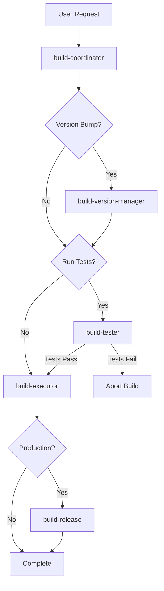

# Build Automation Workflow

## Overview

This workflow automates the build process for the Household Ticket System React Native/Expo mobile application. It orchestrates multiple specialized agents to handle version management, testing, building, and release preparation.

## Quick Start

### Development Build
```
Build the app for local testing
→ Platforms: Android and/or iOS
→ No version bump
→ Skip tests for faster iteration
```

### Preview Build
```
Build for internal testing (TestFlight, internal distribution)
→ Version bump: patch/minor
→ Run all tests
→ Generate preview build
```

### Production Release
```
Complete release process
→ Version bump: patch/minor/major
→ Full test suite
→ Production builds
→ Release notes generation
→ Store submission prep
```

## Agent Architecture



## Build Types

### 1. Development Build
**Purpose**: Local development and testing
**Speed**: Fast (5-10 minutes)
**Use Cases**:
- Daily development
- Feature testing on device
- Debugging
- Quick iterations

**Process**:
1. No version bump
2. Skip tests (optional)
3. Run `expo run:android` or `expo run:ios`
4. Install on connected device/emulator

### 2. Preview Build
**Purpose**: Internal testing and QA
**Speed**: Medium (15-25 minutes)
**Use Cases**:
- Internal team testing
- QA validation
- TestFlight distribution
- Stakeholder demos

**Process**:
1. Patch version bump
2. Run test suite
3. Build via EAS (cloud)
4. Generate preview artifacts
5. Distribute to testers

### 3. Production Build
**Purpose**: App store submission
**Speed**: Full (30-45 minutes)
**Use Cases**:
- App Store submission
- Play Store submission
- Official releases

**Process**:
1. Major/minor version bump
2. Full test suite + coverage
3. Production builds (optimized)
4. Generate release notes
5. Create store submission package
6. Tag repository
7. Archive artifacts

## Workflows

### Workflow 1: Quick Development Build

```bash
# User initiates
"Build the app for Android testing"

# Coordinator validates
→ Check dependencies
→ Verify configuration

# Executor builds
→ expo run:android
→ Copy to device
→ Done in ~8 minutes
```

### Workflow 2: Preview Release

```bash
# User initiates
"Create a preview build with version bump"

# Version Manager
→ Bump version: 1.2.3 → 1.2.4
→ Increment build numbers
→ Update app.json

# Tester
→ Run unit tests
→ Check coverage (85.2%)
→ Tests pass ✓

# Executor
→ eas build --profile preview --platform all
→ Build Android APK + iOS IPA
→ Save artifacts

# Complete
→ Build ready for distribution
→ ~20 minutes total
```

### Workflow 3: Production Release

```bash
# User initiates
"Create a production release for version 1.3.0"

# Version Manager
→ Bump version: 1.2.4 → 1.3.0
→ Increment build numbers
→ Update all config files
→ Create git commit

# Tester
→ Run full test suite
→ Verify coverage >= 80%
→ Run linter
→ Type check
→ All checks pass ✓

# Executor
→ eas build --profile production --platform all
→ Build optimized AAB (Android)
→ Build optimized IPA (iOS)
→ Verify artifacts

# Release Manager
→ Generate changelog from commits
→ Format release notes
→ Create store submission checklists
→ Archive artifacts
→ Create git tag v1.3.0
→ Generate deployment docs

# Complete
→ Production builds ready
→ Release notes prepared
→ Store submission ready
→ ~40 minutes total
```

## Agent Responsibilities

### build-coordinator
**Main orchestrator**
- Validates build environment
- Coordinates all sub-agents
- Manages workflow state
- Reports final status

### build-version-manager
**Version control**
- Semantic versioning
- Build number management
- Configuration updates
- Git tagging

### build-tester
**Quality assurance**
- Unit test execution
- Coverage reporting
- Linting
- Type checking

### build-executor
**Build execution**
- Runs Expo/EAS commands
- Manages build artifacts
- Handles platform specifics
- Error recovery

### build-release
**Release preparation**
- Changelog generation
- Release notes formatting
- Store submission prep
- Artifact archiving

## File Structure

```
Household_Ticket/
├── .claude/
│   ├── agents/
│   │   └── build/
│   │       ├── build-coordinator.md
│   │       ├── build-version-manager.md
│   │       ├── build-tester.md
│   │       ├── build-executor.md
│   │       ├── build-release.md
│   │       └── build-workflow.md (this file)
│   ├── builds/
│   │   └── [timestamp]-[version]/
│   │       ├── android/
│   │       ├── ios/
│   │       ├── build-log.txt
│   │       └── manifest.json
│   ├── tests/
│   │   └── [timestamp]/
│   │       ├── test-report.json
│   │       └── coverage/
│   └── releases/
│       └── v[version]/
│           ├── android/
│           ├── ios/
│           ├── release-notes.md
│           ├── manifest.json
│           └── deployment-guide.md
```

## Usage Examples

### Example 1: Development Build
```
User: "Build the app for Android so I can test on my phone"

Coordinator: 
→ Validates environment
→ Skips version bump
→ Skips tests
→ Calls executor with development profile

Executor:
→ Runs: expo run:android
→ Installs on connected device
→ Reports success

Result: App running on device in ~8 minutes
```

### Example 2: Weekly Preview Build
```
User: "Create a preview build for the team, patch version"

Coordinator:
→ Validates environment
→ Calls version-manager

Version Manager:
→ Bumps: 1.2.3 → 1.2.4
→ Increments build numbers
→ Updates configs

Coordinator:
→ Calls tester

Tester:
→ Runs all tests (43 passed)
→ Coverage: 85.2% ✓
→ Reports success

Coordinator:
→ Calls executor

Executor:
→ Builds preview for both platforms
→ Saves artifacts

Result: Preview builds ready in ~22 minutes
```

### Example 3: Production Release
```
User: "Create production release 2.0.0 - major version bump"

[Full workflow as described in Workflow 3 above]

Result: Production builds, release notes, and store
submission packages ready in ~42 minutes
```

## Best Practices

1. **Always Run Tests for Production**: Never skip tests for production builds
2. **Version Bumps**: Follow semantic versioning strictly
3. **Build Logs**: Always save build logs for troubleshooting
4. **Artifact Organization**: Keep builds organized by version and timestamp
5. **Git Tags**: Always tag production releases
6. **Release Notes**: Write clear, user-friendly release notes
7. **Rollback Plan**: Always document how to rollback
8. **Store Guidelines**: Follow platform-specific submission guidelines

## Error Handling

Common issues and solutions:

### "Expo CLI not found"
→ Install: `npm install -g expo-cli`

### "EAS CLI not configured"
→ Configure: `eas login` then `eas build:configure`

### "Tests failed"
→ Fix failing tests before proceeding
→ Or use `run_tests: false` for non-production builds

### "Build failed"
→ Check build logs in .claude/builds/
→ Common: signing issues, dependency problems, config errors

### "Version conflict"
→ Ensure version in app.json and package.json match
→ Use version-manager to sync

## Integration with CI/CD

This workflow can be integrated with CI/CD systems:

### GitHub Actions Example
```yaml
name: Build and Release
on:
  push:
    tags:
      - 'v*'
jobs:
  build:
    runs-on: ubuntu-latest
    steps:
      - uses: actions/checkout@v2
      - name: Trigger build agent
        run: |
          # Call build-coordinator
          # Pass version from git tag
          # Generate production builds
```

### Manual Triggers
Agents can be triggered manually via Claude Code for more control and oversight.

## Monitoring and Logs

All build processes generate detailed logs:
- **Build Logs**: `.claude/builds/[timestamp]-[version]/build-log.txt`
- **Test Reports**: `.claude/tests/[timestamp]/test-report.json`
- **Release Manifests**: `.claude/releases/v[version]/manifest.json`

## Next Steps

After a successful build:
1. **Development**: Test on physical device
2. **Preview**: Distribute to internal testers
3. **Production**: Submit to app stores using generated checklists

---

**Need help?** Ask the build-coordinator agent with your specific requirements.
